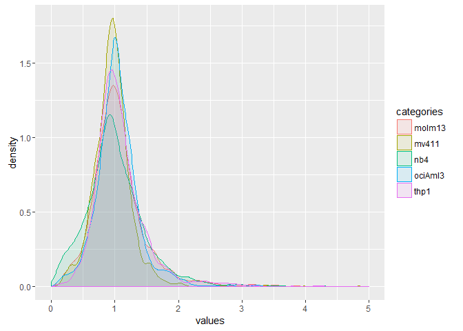

Analysis of Quantitative Proteomics Data
================

The result of a proteomic quantitative analysis is a list of peptide and protein abundances for every protein in different samples, or abundance ratios between the samples. The downstream interpretation of these data varies according to the experimental design. In this chapter we will describe different generic methods for the interpretation of quantitative datasets.

The dataset used here for illustrative purposes is freely available through the ProteomeXchange [(1)](#references) consortium via the PRIDE [(2)](#references) partner repository under the accession number PXD000441, and available in the *resources* folder under *Results\_MQ\_5cell-line-mix*. It consists of five cell lines derived from acute myeloid leukemia (AML) patients measured with a spiked-in internal stanard (IS) obtained from the combination of the same five AML cell lines that have been metabolically labeled with heavy isotopes [(3)](#references) and analyzed using MaxQuant [(4)](#references) version 1.4.1.2. See [(5)](#references) for details.

This chapter introduces the basic methods, and is by no means aiming at covering all possibilities or present a reference workflow. Please continue exploring the data on your own and critically adapt the interpretation workflow to your experiment - there is no one workflow fits all!

Installation
------------

This tutorial uses [R](https://www.r-project.org), a language that allows the simple manipulation of large datasets. We will use R from the open source [RSudio](www.rstudio.com) environment. Please make sure to have RStudio installed on your computer.

We are going to use the [ggplot2](http://ggplot2.org/) library.

``` r
library(ggplot2)
```

File import
-----------

The MaxQuant report files are tab separated text files that can readily be imported in R as data frame. A data frame allows the convenient manipulation of large tables.

``` r
proteinGroupsInput <- read.table(file = "proteinGroups_5cell-line-mix.txt", header = T, stringsAsFactors = F, sep = "\t")
```

You should see the proteinGroupsInput in your *Environment* panel. You can get the size of the table using the *length* function.

``` r
nColumns <- length(proteinGroupsInput)
nLines <- length(proteinGroupsInput$Protein.IDs)
paste("Number of columns: ", nColumns, ", number of protein groups: ", nLines, sep="")
```

    ## [1] "Number of columns: 191, number of protein groups: 3982"

Filtering of the protein groups
-------------------------------

MaxQuant indicates contaminants, decoy sequences, and proteins only identified by site by a '+' in their columns. You can access the number of every category by using the *table* function.

``` r
nContaminants <- table(proteinGroupsInput$Contaminant)
paste("Number of Contaminants: ", nContaminants[2], ", Others: ", nContaminants[1], sep="")
```

    ## [1] "Number of Contaminants: 104, Others: 3878"

``` r
nDecoys <- table(proteinGroupsInput$Reverse)
paste("Number of decoys: ", nDecoys[2], ", Others: ", nDecoys[1], sep="")
```

    ## [1] "Number of decoys: 76, Others: 3906"

``` r
nOnlyIdentifiedBySite <- table(proteinGroupsInput$Only.identified.by.site)
paste("Number of only identified by site: ", nOnlyIdentifiedBySite[2], ", Others: ", nOnlyIdentifiedBySite[1], sep="")
```

    ## [1] "Number of only identified by site: 109, Others: 3873"

Filter these lines and save the result in a new table.

``` r
proteinGroups <- proteinGroupsInput[proteinGroupsInput$Contaminant != '+' & proteinGroupsInput$Reverse != '+' & proteinGroupsInput$Only.identified.by.site != '+',]

nLines <- length(proteinGroups$Protein.IDs)
nFiltered <- length(proteinGroupsInput$Protein.IDs) - length(proteinGroups$Protein.IDs)
paste("New number of protein groups: ", nLines, ", Number of protein groups removed: ", nFiltered, sep="")
```

    ## [1] "New number of protein groups: 3732, Number of protein groups removed: 250"

Extraction of the quantitative columns
--------------------------------------

The expression values of the five cell lines used are stored in different columns as detailed below. They correspond to two states of the disease, *Diagnosis* and *Relapse*.

| Column                  | Cell Line | Condition |
|-------------------------|-----------|-----------|
| Ratio H/L normalized E1 | Molm-13   | Relapse   |
| Ratio H/L normalized E2 | MV4-11    | Diagnosis |
| Ratio H/L normalized E3 | NB4       | Relapse   |
| Ratio H/L normalized E4 | OCI-AML3  | Diagnosis |
| Ratio H/L normalized E5 | THP-1     | Relapse   |

Note that when importing the data in R, spaces and special characters in the column titles were replaces by dots.

We will now store these values in a new table and save the columns of the cell lines at different conditions in two vectors.

``` r
proteinGroupsRatios <- data.frame(proteinIDs = proteinGroups$Protein.IDs, 
                     molm13 = proteinGroups$Ratio.H.L.normalized.E1, 
                     mv411 = proteinGroups$Ratio.H.L.normalized.E2,
                     nb4 = proteinGroups$Ratio.H.L.normalized.E3,
                     ociAml3 = proteinGroups$Ratio.H.L.normalized.E4,
                     thp1 = proteinGroups$Ratio.H.L.normalized.E5)
diagnosisCellLines <- c("mv411", "ociAml3")
relapseCellLines <- c("molm13", "nb4", "thp1")
```

It is possible to extract the ratios of a given protein.

``` r
proteinGroupsRatios[proteinGroupsRatios$proteinIDs == "A0FGR8",]
```

    ##   proteinIDs molm13   mv411     nb4 ociAml3    thp1
    ## 2     A0FGR8 1.0297 0.97241 0.82373 0.87853 0.81302

It is possible to extract the ratios of a given protein for a given condition.

``` r
proteinGroupsRatios[proteinGroupsRatios$proteinIDs == "A0FGR8", names(proteinGroupsRatios) %in% diagnosisCellLines]
```

    ##     mv411 ociAml3
    ## 2 0.97241 0.87853

Note that some proteins have missing values.

``` r
proteinGroupsRatios[proteinGroupsRatios$proteinIDs == "A0JLT2",]
```

    ##   proteinIDs molm13 mv411 nb4 ociAml3 thp1
    ## 3     A0JLT2    NaN   NaN NaN     NaN  NaN

Filtering based on the number of missing values
-----------------------------------------------

It is possible to see whether a value is missing using the is.na function.

``` r
is.na(proteinGroupsRatios[proteinGroupsRatios$proteinIDs == "A0JLT2",])
```

    ##   proteinIDs molm13 mv411  nb4 ociAml3 thp1
    ## 3      FALSE   TRUE  TRUE TRUE    TRUE TRUE

The number of missing values for a condition can be obtained with the sum function.

``` r
sum(is.na(proteinGroupsRatios[proteinGroupsRatios$proteinIDs == "A0JLT2", names(proteinGroupsRatios) %in% diagnosisCellLines]))
```

    ## [1] 2

Filter the ratio table to have at least two valid values in every conition, i.e. no missing value at diagnosis and maximum one at relapse. Doing the sum on every row is done using rowSums.

``` r
nMissingDiagnosis <- rowSums(is.na(proteinGroupsRatios[, names(proteinGroupsRatios) %in% diagnosisCellLines]))
nMissingRelapse <- rowSums(is.na(proteinGroupsRatios[, names(proteinGroupsRatios) %in% relapseCellLines]))
validProteinGroupsRatios <- proteinGroupsRatios[nMissingDiagnosis == 0 & nMissingRelapse <= 1,]

nLines <- length(validProteinGroupsRatios$proteinIDs)
nFiltered <- length(proteinGroupsRatios$proteinIDs) - length(validProteinGroupsRatios$proteinIDs)
paste("New number of protein groups: ", nLines, ", Number of protein groups removed: ", nFiltered, sep="")
```

    ## [1] "New number of protein groups: 1936, Number of protein groups removed: 1796"

The number of protein presenting missing values can be plotted using the code below.

``` r
categoryDiagnosis <- character(length(nMissingDiagnosis))
categoryDiagnosis[] <- "Diagnosis"
categoryRelapse <- character(length(nMissingRelapse))
categoryRelapse[] <- "Relapse"
categories <- c(categoryDiagnosis, categoryRelapse)
values <- c(nMissingDiagnosis, nMissingRelapse)
missingValuesHistogramPlot <- ggplot()
missingValuesHistogramPlot <- missingValuesHistogramPlot + geom_bar(aes(x=values, fill=categories), position = "dodge")
plot(missingValuesHistogramPlot)
```


Transformation of the ratios
----------------------------

The MaxQuant ratios are estimated as *Heavy/Light*, but our reference was on the *Heavy* channel, we therefore need to invert the ratios in order to obtain a value representing the cell line to internal standard ratio.

``` r
validProteinGroupsRatios[,"molm13"] <- 1/validProteinGroupsRatios[,"molm13"]
validProteinGroupsRatios[,"mv411"] <- 1/validProteinGroupsRatios[,"mv411"]
validProteinGroupsRatios[,"nb4"] <- 1/validProteinGroupsRatios[,"nb4"]
validProteinGroupsRatios[,"ociAml3"] <- 1/validProteinGroupsRatios[,"ociAml3"]
validProteinGroupsRatios[,"thp1"] <- 1/validProteinGroupsRatios[,"thp1"]
```

As one can see, the ratios are distributed over positive values around 1.

``` r
categories <- c()
categoryCellLine <- character(length(validProteinGroupsRatios[,"molm13"]))
categoryCellLine[] <- "molm13"
categories <- c(categories, categoryCellLine)
categoryCellLine <- character(length(validProteinGroupsRatios[,"mv411"]))
categoryCellLine[] <- "mv411"
categories <- c(categories, categoryCellLine)
categoryCellLine <- character(length(validProteinGroupsRatios[,"nb4"]))
categoryCellLine[] <- "nb4"
categories <- c(categories, categoryCellLine)
categoryCellLine <- character(length(validProteinGroupsRatios[,"ociAml3"]))
categoryCellLine[] <- "ociAml3"
categories <- c(categories, categoryCellLine)
categoryCellLine <- character(length(validProteinGroupsRatios[,"thp1"]))
categoryCellLine[] <- "thp1"
categories <- c(categories, categoryCellLine)
values <- c(validProteinGroupsRatios[,"molm13"],
            validProteinGroupsRatios[,"mv411"],
            validProteinGroupsRatios[,"nb4"],
            validProteinGroupsRatios[,"ociAml3"],
            validProteinGroupsRatios[,"thp1"])
ratiosDensityPlot <- ggplot()
ratiosDensityPlot <- ratiosDensityPlot + geom_density(aes(x=values, col=categories, fill = categories), alpha = 0.1)
ratiosDensityPlot <- ratiosDensityPlot + xlim(0, 5)
plot(ratiosDensityPlot)
```

    ## Warning: Removed 512 rows containing non-finite values (stat_density).



Before further processing, we log transform these ratios to restore the symmetry around 1.

``` r
validProteinGroupsRatios[,"molm13"] <- log2(validProteinGroupsRatios[,"molm13"])
validProteinGroupsRatios[,"mv411"] <- log2(validProteinGroupsRatios[,"mv411"])
validProteinGroupsRatios[,"nb4"] <- log2(validProteinGroupsRatios[,"nb4"])
validProteinGroupsRatios[,"ociAml3"] <- log2(validProteinGroupsRatios[,"ociAml3"])
validProteinGroupsRatios[,"thp1"] <- log2(validProteinGroupsRatios[,"thp1"])
```

The number of protein presenting missing values can be plotted using the code below.

``` r
categories <- c()
categoryCellLine <- character(length(validProteinGroupsRatios[,"molm13"]))
categoryCellLine[] <- "molm13"
categories <- c(categories, categoryCellLine)
categoryCellLine <- character(length(validProteinGroupsRatios[,"mv411"]))
categoryCellLine[] <- "mv411"
categories <- c(categories, categoryCellLine)
categoryCellLine <- character(length(validProteinGroupsRatios[,"nb4"]))
categoryCellLine[] <- "nb4"
categories <- c(categories, categoryCellLine)
categoryCellLine <- character(length(validProteinGroupsRatios[,"ociAml3"]))
categoryCellLine[] <- "ociAml3"
categories <- c(categories, categoryCellLine)
categoryCellLine <- character(length(validProteinGroupsRatios[,"thp1"]))
categoryCellLine[] <- "thp1"
categories <- c(categories, categoryCellLine)
values <- c(validProteinGroupsRatios[,"molm13"],
            validProteinGroupsRatios[,"mv411"],
            validProteinGroupsRatios[,"nb4"],
            validProteinGroupsRatios[,"ociAml3"],
            validProteinGroupsRatios[,"thp1"])
ratiosDensityPlot <- ggplot()
ratiosDensityPlot <- ratiosDensityPlot + geom_density(aes(x=values, col=categories, fill = categories), alpha = 0.1)
plot(ratiosDensityPlot)
```

    ## Warning: Removed 478 rows containing non-finite values (stat_density).


Normalization of the ratios
---------------------------

The ratios provided by MaxQuant are already normalized, but it can be useful to conduct an additional normalization to correct for biases.

References
----------

1.  [Vizcaino, J.A. et al., *ProteomeXchange provides globally coordinated proteomics data submission and dissemination*, Nature Biotechnology, 2014](https://www.ncbi.nlm.nih.gov/pubmed/24727771)
2.  [Martens, L. et al., *PRIDE: the proteomics identifications database*, Proteomics, 2005](https://www.ncbi.nlm.nih.gov/pubmed/16041671)
3.  [Geiger, T. et al., *Super-SILAC mix for quantitative proteomics of human tumor tissue*, Nature Methods, 2010](https://www.ncbi.nlm.nih.gov/pubmed/20364148)
4.  [Cox, J. and Mann, M, *MaxQuant enables high peptide identification rates, individualized p.p.b. range mass accuracies and proteome-wide protein quantification*, Nature Biotechnology, 2008](https://www.ncbi.nlm.nih.gov/pubmed/19029910)
