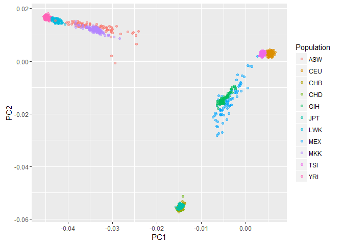
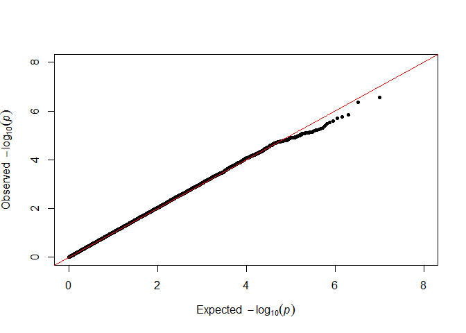
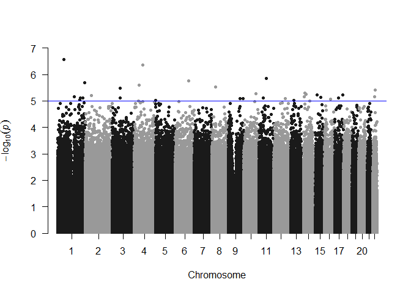

Basic Metods for Genome Wide Association
================

In this tutorial, we will introduce basic solutions to manipulate and visualize the results of genome wide sequencing data. For a complete protocol please refer to [(1)](#references).

Installation
------------

We will need the following libraries: *ggplot2* and *qqman*. Make sure they are installed in your R session.

``` r
install.packages("ggplot2", repos="http://cran.uib.no/")
```

    ## Installing package into 'C:/Users/mva037/Documents/R/win-library/3.2'
    ## (as 'lib' is unspecified)

    ## package 'ggplot2' successfully unpacked and MD5 sums checked
    ## 
    ## The downloaded binary packages are in
    ##  C:\Users\mva037\AppData\Local\Temp\RtmpWasguR\downloaded_packages

``` r
install.packages("qqman", repos="http://cran.uib.no/")
```

    ## Installing package into 'C:/Users/mva037/Documents/R/win-library/3.2'
    ## (as 'lib' is unspecified)

    ## package 'qqman' successfully unpacked and MD5 sums checked
    ## 
    ## The downloaded binary packages are in
    ##  C:\Users\mva037\AppData\Local\Temp\RtmpWasguR\downloaded_packages

``` r
library(ggplot2)
```

    ## Warning: package 'ggplot2' was built under R version 3.2.5

``` r
library(qqman)
```

    ## Warning: package 'qqman' was built under R version 3.2.5

    ## 

    ## For example usage please run: vignette('qqman')

    ## 

    ## Citation appreciated but not required:

    ## Turner, S.D. qqman: an R package for visualizing GWAS results using Q-Q and manhattan plots. biorXiv DOI: 10.1101/005165 (2014).

    ## 

Admixture
---------

A principal component analysis can be used to visualize the main source of variance in the dataset. Please download the file [pca.txt]() to your working folder.

``` r
pcaInput <- read.table(file = "pca.txt", header = T, stringsAsFactors = F)
```

This file contains the results of a PCA conducted on the thousands genomes with associated ethnicity. The variance might be explained by admixture in the dataset.

``` r
pcaPlot <- ggplot()
pcaPlot <- pcaPlot + geom_point(aes(x=pcaInput$pca1, y=pcaInput$pca2, col = pcaInput$population), alpha = 0.5)
pcaPlot <- pcaPlot + labs(x = "PC1", y = "PC2", col = "Population")
plot(pcaPlot)
```



It is possible to set thresholds to prune the population down to a core population by removing outliers on the different dimensions of the PCA.

QQ and Manhattan Plots
----------------------

Please download the file [association.gz]() to your working folder. Note that the file is compressed, but you will be able to read it like any file using the *gzip* function.

``` r
associationInput <- read.table(gzfile("association.gz"), header = T, stringsAsFactors = F)
```

Note that for the sake of time, the dataset has been limited to 5,000,000 markers randomly chosen.

We are going to inspect the calibration of the p-values by drawing a qq-plot. We also estimate lambda that will be image of the inflation at the mediane.

``` r
pValues <- associationInput$P
chisq <- qchisq(1-pValues,1)
lambda <- median(chisq)/qchisq(0.5,1)

expectedPValues <- -log10(chisq)
observedPValues <- -log10(pValues)

qqPlot <- ggplot()
qqPlot <- qqPlot + geom_point(aes(x=expectedPValues, y=observedPValues), size = 1, col = "blue")
qqPlot <- qqPlot + geom_line(aes(x=observedPValues, y=observedPValues), size = 1, alpha = 0.5, linetype = "dotted")
qqPlot <- qqPlot + xlab("Expected p-value [-log]") + ylab("Observed p-value [-log]")
plot(qqPlot)
```



``` r
paste("lambda: ", lambda, sep = "")
```

    ## [1] "lambda: 1.02923302962251"

The inspection of associated SNPs on the whole genome is done using a so-called Manhattan plot. The method is readily implemented in the *qqman* package. Note that its execution can take time depending on the number of markers and the performance of the computer.

``` r
manhattan(associationInput)
```

    ## Warning in manhattan(associationInput): No SNP column found. OK unless
    ## you're trying to highlight.



References
----------

1.  [Clarke, GM. *et al.*, Basic statistical analysis in genetic case-control studies, Nature Protocols, 2011](https://www.ncbi.nlm.nih.gov/pubmed/21293453)
