Analysis of Quantitative Proteomics Data
================

The result of a proteomic quantitative analysis is a list of peptide and protein abundances for every protein in different samples, or abundance ratios between the samples. The downstream interpretation varies according to the experimental design. In this chapter we will describe different generic methods for the interpretation of quantitative datasets.

Identification and Quantification
---------------------------------

The analysis of the raw data yielding the quantitative information constitutes an entire course in itself and is not detailed here. Many bioinformatic environments allow the processing of proteomics data, each coming with specific features and different levels of user friendliness. An inexhaustive list is provided in the table below.

<table style="width:26%;">
<colgroup>
<col width="6%" />
<col width="8%" />
<col width="11%" />
</colgroup>
<thead>
<tr class="header">
<th>Tool</th>
<th>Usage</th>
<th>Comment</th>
</tr>
</thead>
<tbody>
<tr class="odd">
<td><a href="maxquant.org">MaxQuant</a></td>
<td>Untargeted quantification</td>
<td>Tools for quantification and post-processing of untargeted proteomics data.</td>
</tr>
<tr class="even">
<td><a href="https://skyline.ms/project/home/software/Skyline/begin.view">Skyline</a></td>
<td>Targeted quantification</td>
<td>Tool for targeted proteomics and metabolomics.</td>
</tr>
<tr class="odd">
<td><a href="https://www.openms.de/">OpenMS</a></td>
<td>Bioinformatic pipeline</td>
<td>Suite of tools for proteomics and metabolomics that can be chained to build pipelines.</td>
</tr>
<tr class="even">
<td><a href="http://tools.proteomecenter.org">TPP</a></td>
<td>Bioinformatic pipeline</td>
<td>Suite of tools for proteomics that can be chained to build pipelines.</td>
</tr>
<tr class="odd">
<td><a href="https://www.bioconductor.org/packages/release/bioc/html/MSstats.html">MSstats</a></td>
<td>R package</td>
<td>R package for the handling of proteomics data.</td>
</tr>
</tbody>
</table>

MaxQuant [(1)](#references) and Skyline [(2)](#references) are reference tools for the analysis of untargeted and targeted proteomics data, respectively. Both tools provide extensive educational material and are the place to start for beginners. We highly recommend attending their courses.

Data
----

The dataset used for this tutorial is the same as in the *Proteomics Data* chapter. It is freely available through the ProteomeXchange [(3)](#references) consortium via the PRIDE [(4)](#references) partner repository under the accession number PXD000441.

Briefly, the authors spiked a mix of proteins called the Universal Proteomics Standard (UPS) in a background of yeast proteins. The UPS proteins are spiked at different concentrations between samples while the yeast proteins stay the same. The summary table of the quantification results is available in the [resources](resources/Supplementary%20Table%201.xlsx) folder.

:speech\_balloon: *What is shown in row/columns in the file?*

Github
------

It has become good practice to share data, code and documentation related to scientific projects. Github is a collaborative environment that is based around the git versioning system.

:pencil2: Go to the tutorial repository [github.com/FaroePracticalBioinformatics/tutorials18](https://github.com/FaroePracticalBioinformatics/tutorials18) and click on `Fork`.

This will create a copy of the repository to you own Github space. You can then work on the code by yourself and make changes. You can also submit you changes to the main repository via a `Pull Request`.

:pencil2: In your Github repository, copy the URL available under *Clone or download*.

Tools
-----

While we could process this data set in Excel, this would limit us in terms of what we can do with the data, and it does not scale to larger experiments. Modern data interpretation is done programmatically. It takes time and frustration to get acquainted with this different paradigm, but you will quickly reach a point where you can do much better much faster. Several languages and frameworks make this possible, the most encountered are Python, R, Matlab, and Mathematica. They can be used in command line or via user interfaces. Recently, notebooks mixing code and comments gained popularity for their ability to combine documentation and reproducibility. Also, note that Perseus, the companion tool of MaxQuant allows processing large omics data sets in a graphical environment.

This tutorial uses [R](https://www.r-project.org), a language that allows the simple manipulation of large datasets. We will use R from the open source [RSudio](www.rstudio.com) environment. Please make sure to have RStudio installed on your computer.

:pencil2: Create a new project via the *File* -&gt; *New Project* menu. Select *Version Control* and put the URL to the repository copied previously.

You now have an image of the repository on your computer that is synchronized with the version in Github.

The commands used in this tutorial are given in line and the results produced are preceded by `##`. You can copy the commands of this tutorial in your script, where one line corresponds to a command. The commands can be run line by line using the *Run* button. Alternatively, you can run the entire script using the *Source* button. Note that it is also possible to run the commands in the *Console*.

We are going to use the [ggplot2](http://ggplot2.org/) library. If you did not install this package already, install it usng the *Packages* tab or run `install.packages("ggplot2")`.

``` r
library(ggplot2)
```

*ggplot2* has different themes for display, we are not going to use the default and instead set a theme for the whole project.

``` r
theme_set(theme_bw(base_size = 11))
```

Many packages allow customizing the plots. We are going to use the following.

``` r
library(ggrepel)
library(ggdendro)
library(scico)
library(gtable)
library(grid)
```

File import
-----------

Most software output text files that can readily be imported in R as data frame. A data frame is a representation of a table just like an Excel sheet. The table used in our analysis is

``` r
proteinGroupsInput <- read.table(file = "resources/mq.txt", header = T, stringsAsFactors = F, sep = "\t")
```

You should see the `proteinGroupsInput` in your *Environment* panel. You can view the file using the `View` command.

``` r
View(proteinGroupsInput)
```

You can look at how many background (yeast) and spiked (UPS) proteins are found using the `table` function.

``` r
table(proteinGroupsInput$Species)
```

    ## 
    ##         UPS yeast 
    ##    71   143  2482

The columns with quantitative information are indicated as A1, A2, A3, B1, B2, and B3, where A and B represent the different conditions of the first column and 1, 2, and, 3 biological replicates. You can plot one column against the other using the `plot` function.

``` r
plot(proteinGroupsInput$A1, proteinGroupsInput$B2)
```

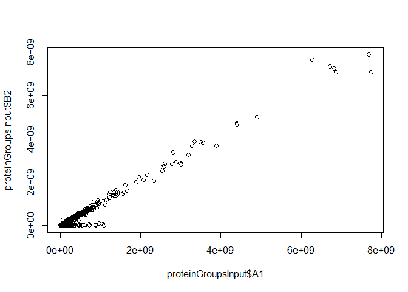

:pencil2: Try to plot different columns against each other's.

You can look at the distribution of intensities using the `hist` function. First, concatenate all intensities in a vector.

``` r
allIntensities <- c(
    proteinGroupsInput$A1,
    proteinGroupsInput$A2,
    proteinGroupsInput$A3,
    proteinGroupsInput$B1,
    proteinGroupsInput$B2,
    proteinGroupsInput$B3
)
```

Then, simply call the hist function.

``` r
hist(allIntensities)
```

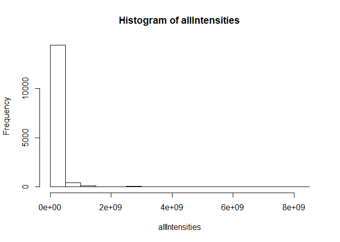

As you can see, most of the intensities are on the lower side of the x axis. Plotting the histogram of the log will allow us to see how the order of magnitude of the intensities distribute.

``` r
hist(log10(allIntensities))
```

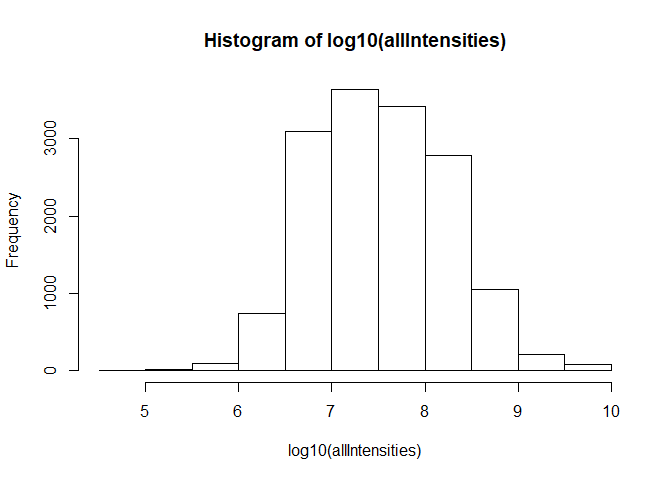

We now create log values of the intensities, and whenever we will work on the intensities in column, we will use the log values.

``` r
    proteinGroupsInput$A1_log <- log10(proteinGroupsInput$A1)
    proteinGroupsInput$A2_log <- log10(proteinGroupsInput$A2)
    proteinGroupsInput$A3_log <- log10(proteinGroupsInput$A3)
    proteinGroupsInput$B1_log <- log10(proteinGroupsInput$B1)
    proteinGroupsInput$B2_log <- log10(proteinGroupsInput$B2)
    proteinGroupsInput$B3_log <- log10(proteinGroupsInput$B3)
```

In the following, we are going to use the `ggplot2` package to build plots. It is a powerful data visualization library that will allow us getting a better understanding of the data.

The first step is to organize our data in a data frame with a single column containing all the values to plot, and covariates in other columns.

``` r
nProteins <- nrow(proteinGroupsInput)

intensitiesDF <- data.frame(
    intensity = c(
        proteinGroupsInput$A1_log,
        proteinGroupsInput$A2_log,
        proteinGroupsInput$A3_log,
        proteinGroupsInput$B1_log,
        proteinGroupsInput$B2_log,
        proteinGroupsInput$B3_log
    ),
    sample = c(
        rep("A1", nProteins),
        rep("A2", nProteins),
        rep("A3", nProteins),
        rep("B1", nProteins),
        rep("B2", nProteins),
        rep("B3", nProteins)
    ),
    condition = c(
        rep("A", nProteins),
        rep("A", nProteins),
        rep("A", nProteins),
        rep("B", nProteins),
        rep("B", nProteins),
        rep("B", nProteins)
    ),
    replicate = c(
        rep("1", nProteins),
        rep("2", nProteins),
        rep("3", nProteins),
        rep("1", nProteins),
        rep("2", nProteins),
        rep("3", nProteins)
    )
)

View(intensitiesDF)
```

Now we will build the histogram using the `geom_histogram` function and plot using the default `plot` function.

``` r
histogram <- ggplot() + geom_histogram(data = intensitiesDF, mapping = aes(x = intensity), bins = 20, na.rm = T)

plot(histogram)
```

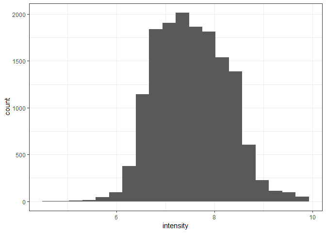

:speech\_balloon: *Do you expect the different samples to display similar intensity distributions?*

You can easily plot the different samples separately by using the `facet_grid` function.

``` r
histogram <- ggplot() + 
    geom_histogram(data = intensitiesDF, mapping = aes(x = intensity), bins = 20, na.rm = T) +
    facet_grid(condition ~ replicate)

plot(histogram)
```

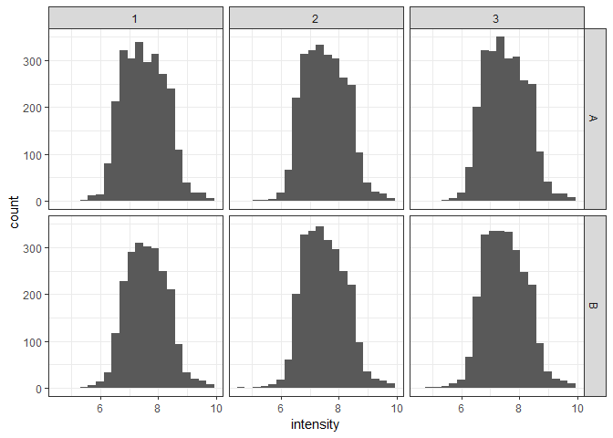

:pencil2: Can you plot the density instead of a histogram?

A very useful way to visualize quantitative distributions is to make box plots. This can be done using the `geom_boxplot` function.

``` r
boxPlot <- ggplot() + 
    geom_boxplot(data = intensitiesDF, mapping = aes(x = sample, y = intensity), na.rm = T)

plot(boxPlot)
```

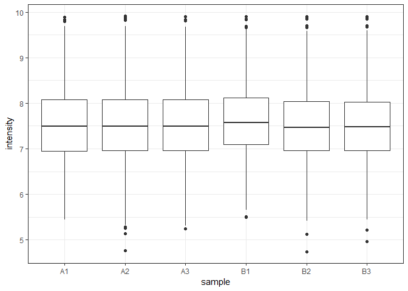

[:thought\_balloon:6](../Answers.md#thought_balloon6) *What is represented by a box plot?*

Similarly, you can display the density as *violin plot* using the function `geom_violin`.

``` r
violinPlot <- ggplot() + 
    geom_violin(data = intensitiesDF, mapping = aes(x = sample, y = intensity), na.rm = T)

plot(violinPlot)
```

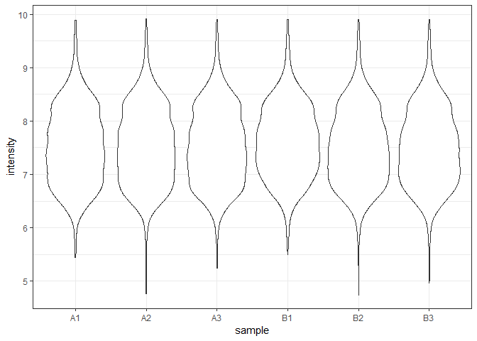

Note that it is possible to overlay geometries in ggplot.

``` r
violinPlot <- ggplot() + 
    geom_violin(data = intensitiesDF, mapping = aes(x = sample, y = intensity), na.rm = T) +
    geom_boxplot(data = intensitiesDF, mapping = aes(x = sample, y = intensity), width = 0.5, na.rm = T)

plot(violinPlot)
```

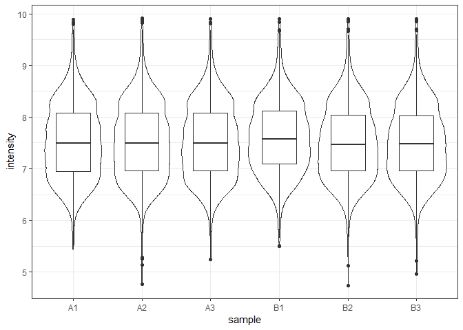

Missing values filtering
------------------------

As you might have noticed, in all functions used previously, we have removed missing values indicated by *NA* using `na.rm = T`. You can find them with the `is.na` function.

``` r
print("A1")
```

    ## [1] "A1"

``` r
sum(is.na(proteinGroupsInput$A1))
```

    ## [1] 98

``` r
print("A2")
```

    ## [1] "A2"

``` r
sum(is.na(proteinGroupsInput$A2))
```

    ## [1] 97

``` r
print("A3")
```

    ## [1] "A3"

``` r
sum(is.na(proteinGroupsInput$A3))
```

    ## [1] 101

``` r
print("B1")
```

    ## [1] "B1"

``` r
sum(is.na(proteinGroupsInput$B1))
```

    ## [1] 468

``` r
print("B2")
```

    ## [1] "B2"

``` r
sum(is.na(proteinGroupsInput$B2))
```

    ## [1] 141

``` r
print("B3")
```

    ## [1] "B3"

``` r
sum(is.na(proteinGroupsInput$B3))
```

    ## [1] 132

:speech\_balloon: *Where do missing values come from? Do you see different patterns between samples? How should we handle this?*

In this tutorial, we will allow only one missing value in each condition. The following code counts the number of missing values in *A* samples and makes a new data frame with max one missing value among *A* samples, this is done using the `apply` function, that allows calling a function on the rows, columns, or cells of a matrix.

``` r
aValues <- proteinGroupsInput[, c("A1", "A2", "A3")]
aNA <- apply(X = aValues, FUN = is.na, MARGIN = c(1, 2))
aNaSum <- apply(X = aNA, FUN = sum, MARGIN = 1)

proteinGroupsAfiltered <- proteinGroupsInput[aNaSum <= 1, ]

print(paste0("# proteins excluded: ", nrow(proteinGroupsInput) - nrow(proteinGroupsAfiltered)))
```

    ## [1] "# proteins excluded: 93"


    proteinGroups <- ?

    print(paste0("# proteins excluded: ", nrow(proteinGroupsAfiltered) - nrow(proteinGroups)))

:pencil2: Do the same for condition *B* and save the result in a data frame called `proteinGroups`.

We can check the number of missing values in each condition using the `table` function again.

``` r
aValues <- proteinGroups[, c("A1", "A2", "A3")]
aNA <- apply(X = aValues, FUN = is.na, MARGIN = c(1, 2))
aNaSum <- apply(X = aNA, FUN = sum, MARGIN = 1)

bValues <- proteinGroups[, c("B1", "B2", "B3")]
bNA <- apply(X = bValues, FUN = is.na, MARGIN = c(1, 2))
bNaSum <- apply(X = bNA, FUN = sum, MARGIN = 1)

allValues <- cbind(aValues, bValues)
allNA <- apply(X = allValues, FUN = is.na, MARGIN = c(1, 2))
allNaSum <- apply(X = allNA, FUN = sum, MARGIN = 1)

print("# protein with missing values in A: ")
```

    ## [1] "# protein with missing values in A: "

``` r
table(aNaSum)
```

    ## aNaSum
    ##    0    1 
    ## 2500   28

``` r
print("# protein with missing values in B: ")
```

    ## [1] "# protein with missing values in B: "

``` r
table(bNaSum)
```

    ## bNaSum
    ##    0    1 
    ## 2190  338

``` r
print("# protein with missing values: ")
```

    ## [1] "# protein with missing values: "

``` r
table(allNaSum)
```

    ## allNaSum
    ##    0    1 
    ## 2162  366

Missing values imputation
-------------------------

Many analysis methods do not support missing values, we are going to make a new data frame where missing values are imputed. Here, we hypothesize that missing values are due to proteins being below the level of quantification. We will therefore impute missing values to an arbitrarily low value.

:speech\_balloon: *Can you think of another way to impute missing values?*

In the following code, we create a function that replaces NAs with random values generated from a normal distribution under an arbitrary level using the `rnorm` function.

``` r
impute <- function(value, mean, sd, limit) {
    
    if (!is.na(value)) {
        return(value)
    }
    
    while (T) {
        
        
        result <- rnorm(1, mean = mean, sd = sd)
        
        if (result < limit) {
            
            return(result)
            
        }   
    }
    
    return(NA)
    
}
```

We then create new columns with imputed missing values.

``` r
for (column in c("A1", "A2", "A3", "B1", "B2", "B3")) {
    
    logCol <- paste0(column, "_log")
    imputedCol <- paste0(column, "_imputed")
    imputedLogCol <- paste0(logCol, "_imputed")
    
    mean <- mean(proteinGroups[, logCol], na.rm = T)
    sd <- sd(proteinGroups[, logCol], na.rm = T)
    limit <- min(proteinGroups[, logCol], na.rm = T)
    
    proteinGroups[, imputedLogCol] <- sapply(X = proteinGroups[, logCol], FUN = impute, mean = mean, sd = sd, limit = limit)
    
    proteinGroups[, imputedCol] <- 10 ^ proteinGroups[, imputedLogCol]
    
}
```

:speech\_balloon: *Why is the imputation done using the log values?*

Let's look at the distribution of values now using different colors for imputed values.

``` r
# Make a data frame of values to plot

nProteins <- nrow(proteinGroups)

intensitiesDF <- data.frame(
    intensity = c(
        proteinGroups$A1_log_imputed,
        proteinGroups$A2_log_imputed,
        proteinGroups$A3_log_imputed,
        proteinGroups$B1_log_imputed,
        proteinGroups$B2_log_imputed,
        proteinGroups$B3_log_imputed
    ),
    sample = c(
        rep("A1", nProteins),
        rep("A2", nProteins),
        rep("A3", nProteins),
        rep("B1", nProteins),
        rep("B2", nProteins),
        rep("B3", nProteins)
    ),
    condition = c(
        rep("A", nProteins),
        rep("A", nProteins),
        rep("A", nProteins),
        rep("B", nProteins),
        rep("B", nProteins),
        rep("B", nProteins)
    ),
    replicate = c(
        rep("1", nProteins),
        rep("2", nProteins),
        rep("3", nProteins),
        rep("1", nProteins),
        rep("2", nProteins),
        rep("3", nProteins)
    ),
    imputed = c(
        is.na(proteinGroups$A1_log),
        is.na(proteinGroups$A2_log),
        is.na(proteinGroups$A3_log),
        is.na(proteinGroups$B1_log),
        is.na(proteinGroups$B2_log),
        is.na(proteinGroups$B3_log)
    )
)


# Build plot

histogram <- ggplot() + 
    geom_histogram(data = intensitiesDF, mapping = aes(x = intensity, fill = imputed), bins = 20) +
    facet_grid(condition ~ replicate)


# Plot

plot(histogram)
```

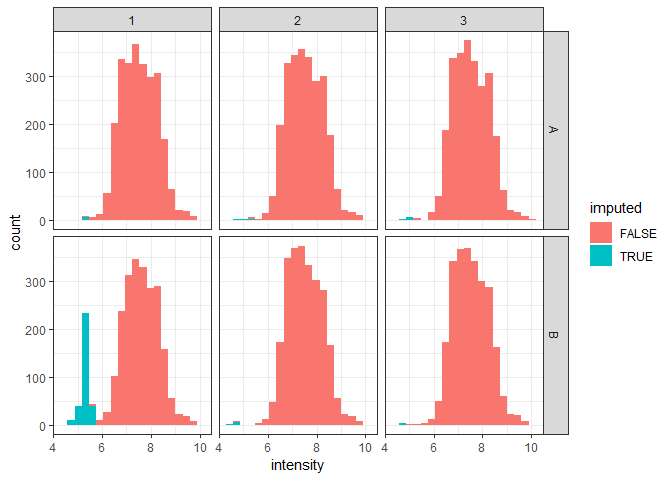

:speech\_balloon: *What do you think of our imputation function? Of missing values imputation in general?*

Normalization
-------------

As you might have noticed from the box plot of intensities, there seem to be minor shifts between samples. We are therefore going to normalize the intensities. Note that MaxQuant already normalized the data, higher shifts are expected when working with raw data.

:speech\_balloon: *Why do we want to correct for systematic deviation between our samples?*

First, we express each intensity relatively to a reference intensity, as a ratio of intensities, this is called *normalization in rows*. Here, we hypothesize that proteins in condition *A* have the most stable abundance, for each protein, we therefore divide the intensity to the median of intensities in *A*. Note that we work here on the actual intensities and not the log.

``` r
reference <- apply(X = proteinGroups[, c("A1_imputed", "A2_imputed", "A3_imputed")], FUN = median, MARGIN = 1, na.rm = T)

proteinGroups$rA1 <- proteinGroups$A1_imputed / reference
proteinGroups$rA2 <- proteinGroups$A2_imputed / reference
proteinGroups$rA3 <- proteinGroups$A3_imputed / reference
proteinGroups$rB1 <- proteinGroups$B1_imputed / reference
proteinGroups$rB2 <- proteinGroups$B2_imputed / reference
proteinGroups$rB3 <- proteinGroups$B3_imputed / reference
```

We can visualize the distribution of ratios like previously done for the intensities, by creating a data frame and plotting summary statistics using ggplot.

``` r
nProteins <- nrow(proteinGroups)

ratiosDF <- data.frame(
    ratio = c(
        proteinGroups$rA1,
        proteinGroups$rA2,
        proteinGroups$rA3,
        proteinGroups$rB1,
        proteinGroups$rB2,
        proteinGroups$rB3
    ),
    sample = c(
        rep("A1", nProteins),
        rep("A2", nProteins),
        rep("A3", nProteins),
        rep("B1", nProteins),
        rep("B2", nProteins),
        rep("B3", nProteins)
    ),
    condition = c(
        rep("A", nProteins),
        rep("A", nProteins),
        rep("A", nProteins),
        rep("B", nProteins),
        rep("B", nProteins),
        rep("B", nProteins)
    ),
    replicate = c(
        rep("1", nProteins),
        rep("2", nProteins),
        rep("3", nProteins),
        rep("1", nProteins),
        rep("2", nProteins),
        rep("3", nProteins)
    )
)

ratioPlot <- ggplot() + 
    geom_boxplot(data = ratiosDF, mapping = aes(x = sample, y = ratio), na.rm = T)

plot(ratioPlot)
```

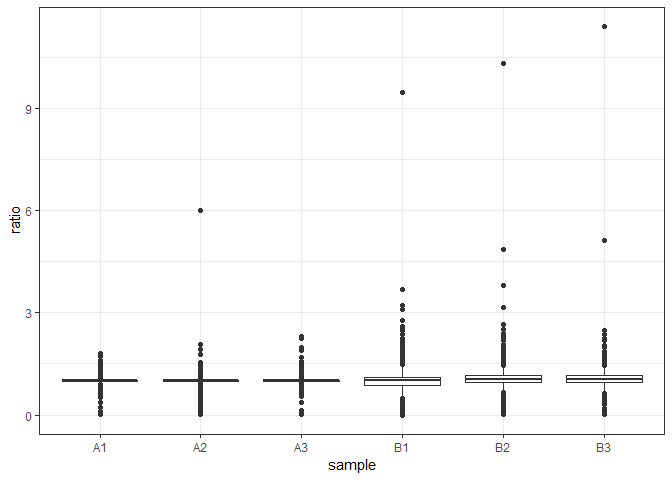

It appears that the distributions are distributed closely around 1. However, you will observe that ratios are not symmetrical around 1. This can be corrected by taking the log of the ratios. Note that in biology we often use a log2 for ratios.

``` r
ratiosDF$ratioLog <- log2(ratiosDF$ratio)

proteinGroups$rA1_log <- log2(proteinGroups$rA1)
proteinGroups$rA2_log <- log2(proteinGroups$rA2)
proteinGroups$rA3_log <- log2(proteinGroups$rA3)
proteinGroups$rB1_log <- log2(proteinGroups$rB1)
proteinGroups$rB2_log <- log2(proteinGroups$rB2)
proteinGroups$rB3_log <- log2(proteinGroups$rB3)

ratioPlot <- ggplot() + 
    geom_boxplot(data = ratiosDF, mapping = aes(x = sample, y = ratioLog), na.rm = T)

plot(ratioPlot)
```

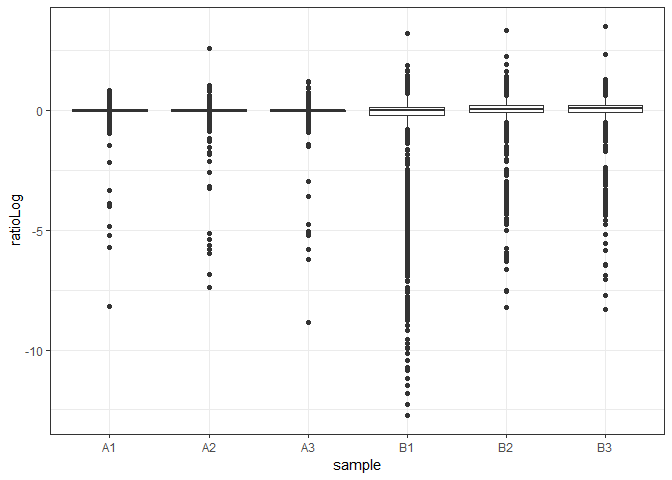

Here, we hypothesize that the majority of the proteins have the same abundance in all samples, i.e. the median of the ratios in all samples should be 1, 0 in log scale. However, if you zoom on the plot, you will see that the median of ratios deviates from 0, this is particularly visible for the B condition. We will therefore subtract the median of log ratios in each sample, this is called *normalization in columns*.

[:thought\_balloon:7](../Answers.md#thought_balloon7) *Why do we subtract while we were dividing before?*

``` r
proteinGroups$rA1_log_norm <- proteinGroups$rA1_log - median(proteinGroups$rA1_log, na.rm = T)
proteinGroups$rA2_log_norm <- proteinGroups$rA2_log - median(proteinGroups$rA2_log, na.rm = T)
proteinGroups$rA3_log_norm <- proteinGroups$rA3_log - median(proteinGroups$rA3_log, na.rm = T)
proteinGroups$rB1_log_norm <- proteinGroups$rB1_log - median(proteinGroups$rB1_log, na.rm = T)
proteinGroups$rB2_log_norm <- proteinGroups$rB2_log - median(proteinGroups$rB2_log, na.rm = T)
proteinGroups$rB3_log_norm <- proteinGroups$rB3_log - median(proteinGroups$rB3_log, na.rm = T)
```

:speech\_balloon: *What additional normalization could we do conduct? How should we adapt this procedure to other experimental designs?*

Dimension reduction
-------------------

When working with many different samples, it can become difficult to visualize all columns. We then do a so-called dimension reduction that projects the data in a two dimensional space. The most common type of dimension reduction approach is the Principal Component Analysis (PCA). It can be done using the `prcomp` function.

``` r
pcaInput <- proteinGroups[, c("rA1_log_norm", "rA2_log_norm", "rA3_log_norm", "rB1_log_norm", "rB2_log_norm", "rB3_log_norm")]

pca <- prcomp(pcaInput)
```

The quantitative information is now projected in a base of six dimensions, the *principal components*, each carrying an amount of the total variance. We can plot this from the *sdev* attribute of the pca result.

``` r
eigenValues <- pca$sdev ^ 2
totalEigenValue <- sum(eigenValues)
pcContribution <- 100 * eigenValues / totalEigenValue

pcPlot <- ggplot() + 
    geom_col(mapping = aes(x = 1:6, y = pcContribution)) + 
    xlab("PC") + 
    ylab("Proportion of Variance [%]")

plot(pcPlot)
```


As you can see, most of the variance is represented by the two first PCs. We are then going to plot the samples in the PC1 vs PC2 space.

``` r
pc1 <- pca$rotation[,1]
pc2 <- pca$rotation[,2]
names <- dimnames(pca$rotation)[[1]]
contribution1 <- round(100 * eigenValues[1] / totalEigenValue)
contribution2 <- round(100 * eigenValues[2] / totalEigenValue)

pcaPlot <- ggplot() + 
    geom_point(mapping = aes(x = pc1, y = pc2)) + 
    geom_label_repel(aes(x = pc1, y = pc2, label = names)) + 
    xlab(paste0("PC1 [", contribution1, "%]")) + 
    ylab(paste0("PC2 [", contribution2, "%]"))

plot(pcaPlot)
```

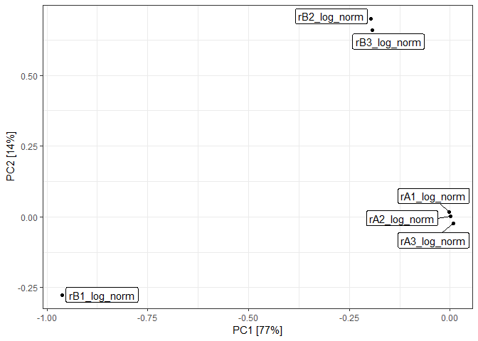

:speech\_balloon: *How do you interpret this plot?*

Here, we anticipate that UPS proteins and imputed values can have a strong contribution to the global variance. We can visualize this using the rotated matrix *x* of the PCA results.

``` r
rotatedData <- as.data.frame(pca$x)

rotatedData$species <- proteinGroups$Species
rotatedData$nMissing <- is.na(proteinGroups$A1) + 
    is.na(proteinGroups$A2) + 
    is.na(proteinGroups$A3) + 
    is.na(proteinGroups$B1) + 
    is.na(proteinGroups$B2) + 
    is.na(proteinGroups$B3)

rotatedData$species_imputed <- paste(rotatedData$species, rotatedData$nMissing, sep = "_")

rotationPlot <- ggplot() + 
    geom_point(data = rotatedData, mapping = aes(x = PC1, y = PC2, col = species_imputed), alpha = 0.5)

plot(rotationPlot)
```

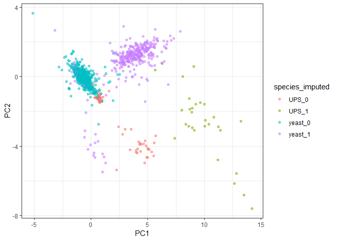

:speech\_balloon: *How do you relate this plot to the PCA plot?*

Hierarchical clustering
-----------------------

From the PCA plot, we could see that samples and proteins seem to form groups in the PC dimensions. We are now going to investigate whether proteins and samples from clusters using hierarchical clustering. For this, we compute a distance matrix using the `dist` function, and then run hierarchical clustering using the `hclust` function.

``` r
hClustColumns <- c("rA1_log_norm", "rA2_log_norm", "rA3_log_norm", "rB1_log_norm", "rB2_log_norm", "rB3_log_norm")

inputProteins <- as.matrix(proteinGroups[, hClustColumns])
inputSamples <- t(inputProteins)

distMatrixProteins <- dist(inputProteins)
hClustProteins <- hclust(distMatrixProteins)

distMatrixSamples <- dist(inputSamples)
hClustSamples <- hclust(distMatrixSamples)
```

Note that we ran the clustering in rows and in columns, for clustering of proteins and samples, respectively. You can now see how the different samples cluster.

``` r
plot(hClustSamples)
```

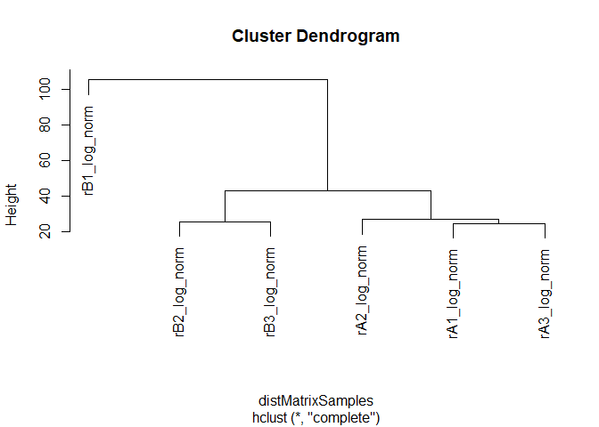

:speech\_balloon: *How do you relate this plot to the PCA plot?*

For proteins, the picture becomes very busy.

``` r
plot(hClustProteins)
```


Instead, we are going to plot the matrix of ratios ordered according to the clustering.

``` r
# Create data frame of ratios

nProteins <- nrow(proteinGroups)

ratiosDF <- data.frame(
    ratio = c(
        proteinGroups$rA1_log_norm,
        proteinGroups$rA2_log_norm,
        proteinGroups$rA3_log_norm,
        proteinGroups$rB1_log_norm,
        proteinGroups$rB2_log_norm,
        proteinGroups$rB3_log_norm
    ),
    proteinRank = c(
        1:nProteins,
        1:nProteins,
        1:nProteins,
        1:nProteins,
        1:nProteins,
        1:nProteins
    ),
    species = c(
        proteinGroups$Species,
        proteinGroups$Species,
        proteinGroups$Species,
        proteinGroups$Species,
        proteinGroups$Species,
        proteinGroups$Species
    ),
    name = c(
        rep("rA1", nProteins),
        rep("rA2", nProteins),
        rep("rA3", nProteins),
        rep("rB1", nProteins),
        rep("rB2", nProteins),
        rep("rB3", nProteins)
    ),
    condition = c(
        rep("A", nProteins),
        rep("A", nProteins),
        rep("A", nProteins),
        rep("B", nProteins),
        rep("B", nProteins),
        rep("B", nProteins)
    ),
    replicate = c(
        rep("1", nProteins),
        rep("2", nProteins),
        rep("3", nProteins),
        rep("1", nProteins),
        rep("2", nProteins),
        rep("3", nProteins)
    )
)

# Order samples according to clustering results

names <- c("rA1", "rA2", "rA3", "rB1", "rB2", "rB3")
orderedSamples <- names[hClustSamples$order]

ratiosDF$orderedSamples <- factor(ratiosDF$name, levels = orderedSamples)
ratiosDF$x <- as.numeric(ratiosDF$orderedSamples)

# Order proteins according to clustering results

ratiosDF$orderedProteins <- factor(ratiosDF$proteinRank, levels = hClustProteins$order)
ratiosDF$y <- as.numeric(ratiosDF$orderedProteins)

# Adjust colors

minRatio <- min(ratiosDF$ratio)
maxRatio <- max(ratiosDF$ratio)
maxabsRatio <- max(abs(ratiosDF$ratio))

# Make plot

hcPlot <- ggplot() +
    geom_raster(data = ratiosDF, mapping = aes(x = x, y = y, fill = ratio)) +
    scale_fill_scico(palette = "vik", begin = (maxabsRatio + minRatio) / (2 * maxabsRatio), end = 1 - ((maxabsRatio - maxRatio) / (2 * maxabsRatio))) +
    scale_x_continuous(name = "Sample", breaks = 1:6, labels = orderedSamples, expand = c(0, 0)) +
    scale_y_continuous(name = "Protein", expand = c(0, 0)) +
    theme(axis.text.y = element_blank(),
          axis.ticks.y = element_blank())

plot(hcPlot)
```

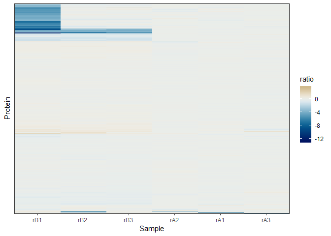

Finally, we add the dendrograms showing the clustering. This is done by plotting the dendrograms separately and arranging the plots using gtable.

``` r
# Make dendrogram plots

dendrogramSamples <- dendro_data(hClustSamples, type="rectangle")
dendrogramDataSamples <- segment(dendrogramSamples)

dendrogramSamplesPlot <- ggplot() + 
    geom_segment(data = dendrogramDataSamples, mapping = aes(x=x, y=y, xend=xend, yend=yend)) + 
    scale_y_continuous(expand = c(0, 0)) + 
    scale_x_continuous(expand = c(0, 0), limits = c(0.5, 6.5)) + 
    theme(axis.line = element_blank(),
          axis.ticks = element_blank(),
          axis.text = element_blank(),
          axis.title = element_blank(),
          panel.background = element_blank(),
          panel.grid = element_blank(),
          panel.border = element_blank())

dendrogramProteins <- dendro_data(hClustProteins, type="rectangle")
dendrogramDataProteins <- segment(dendrogramProteins)

dendrogramProteinsPlot <- ggplot() + 
    geom_segment(data = dendrogramDataProteins, mapping = aes(x=x, y=y, xend=xend, yend=yend)) + 
    coord_flip() + 
    scale_y_reverse(expand = c(0, 0)) + 
    scale_x_continuous(expand = c(0, 0), limits = c(0.5, nProteins + 0.5)) + 
    theme(axis.line = element_blank(),
          axis.ticks = element_blank(),
          axis.text = element_blank(),
          axis.title = element_blank(),
          panel.background = element_blank(),
          panel.grid = element_blank(),
          panel.border = element_blank())

# Make grobs from plots

matrixGrob <- ggplotGrob(hcPlot)
dendroSampleGrob <- ggplotGrob(dendrogramSamplesPlot)
dendroProteinGrob <- ggplotGrob(dendrogramProteinsPlot)

# Assemble

bottomGrob <- cbind(dendroProteinGrob[, 5], matrixGrob[, 5:ncol(matrixGrob)], size = "last")
bottomGrob <- cbind(matrixGrob[, 1:4], bottomGrob, size = "last")

dendroSampleGrob <- gtable_add_cols(dendroSampleGrob, unit(1, "null"), pos = 0)
dendroSampleGrob <- gtable_add_cols(dendroSampleGrob, unit(rep(1, ncol(bottomGrob) - ncol(dendroSampleGrob)), "null"), pos = -1)

result <- rbind(dendroSampleGrob[7, ], bottomGrob[7:nrow(bottomGrob), ], size = "last")
result <- rbind(bottomGrob[1:6, ], result, size = "last")

# Adjust sizes

result$heights[7] <- unit(0.2, "null")
result$widths[5] <- unit(0.2, "null")

# Plot

grid.newpage()
grid.draw(result)
```

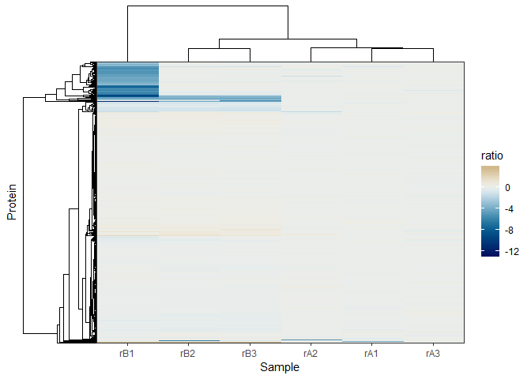

Statistical test
----------------

We are going to evaluate the significance of the differences between A and B using a t-test. Here is an example for the first protein.

:pencil2: Set the `alternative` and `paired` variables.


    alternative <- ?
    paired <- ?

``` r
valuesA <- as.numeric(proteinGroups[1, c("rA1_log_norm", "rA2_log_norm", "rA3_log_norm")])
valuesB <- as.numeric(proteinGroups[1, c("rB1_log_norm", "rB2_log_norm", "rB3_log_norm")])
t.test(x = valuesA, y = valuesB, alternative = alternative, paired = paired)
```

    ## 
    ##  Welch Two Sample t-test
    ## 
    ## data:  valuesA and valuesB
    ## t = 4.7425, df = 2.0073, p-value = 0.04141
    ## alternative hypothesis: true difference in means is not equal to 0
    ## 95 percent confidence interval:
    ##   0.7737305 15.3608038
    ## sample estimates:
    ##   mean of x   mean of y 
    ## -0.03689275 -8.10415990

:speech\_balloon: *Why did we use two-sided non-paired?*

We are now going to iterate the data frame and store the test statistic, p-value and the fold change of each protein.

``` r
proteinGroups$foldChange <- NA
proteinGroups$tStat <- NA
proteinGroups$pValue <- NA

for (i in 1:nrow(proteinGroups)) {
    
    valuesA <- as.numeric(proteinGroups[i, c("rA1_log_norm", "rA2_log_norm", "rA3_log_norm")])
    valuesB <- as.numeric(proteinGroups[i, c("rB1_log_norm", "rB2_log_norm", "rB3_log_norm")])
    testResults <- t.test(x = valuesA, y = valuesB, alternative = alternative, paired = paired)
    
    proteinGroups$pValue[i] <- testResults$p.value
    proteinGroups$tStat[i] <- testResults$statistic
    proteinGroups$foldChange[i] <- median(valuesB) - median(valuesA)
    
}
```

A common way to look at the results of the comparison between two conditions is to plot `-log10(p-value)` against the fold change. This is called a Volcano plot.

``` r
proteinGroups$pValue_log <- -log10(proteinGroups$pValue)

volcanoPlot <- ggplot() +
    geom_point(data = proteinGroups, mapping = aes(x = foldChange, y = pValue_log), alpha = 0.2)

plot(volcanoPlot)
```

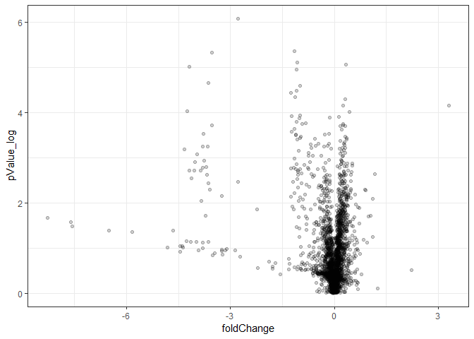

:speech\_balloon: *Based on this plot, which proteins would you call differentially abundant between A and B?*

In this dataset, the UPS proteins are known to be different between *A* and *B*. We can color the dots in the volcano plot based on whether they correspond to UPS proteins. We also indicate with a horizontal line a canonical p-value threshold of 0.05.

``` r
volcanoPlot <- ggplot() +
    geom_point(data = proteinGroups, mapping = aes(x = foldChange, y = pValue_log, col = Species), alpha = 0.2) +
    geom_hline(yintercept = -log10(0.05), col = "darkgreen", linetype = "dashed") +
    scale_color_manual(values = c("red3", "black"))

plot(volcanoPlot)
```

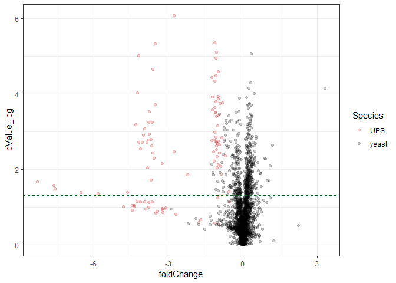

:speech\_balloon: *We have 2528 protein groups, how many do we expect to fall below a p-value of 0.05 by chance? What do you think of this p-value threshold?*

:pencil2: Count the number of yeast and UPS protein groups with p-value &lt; 0.05.

QQ Plot
-------

A simple way to plot how the distribution of p-values deviates compared to what would be expected by chance is to draw a quantile-quantile plot (qq-plot). In this case, the quantiles of the observed p-values are plotted against the expected quantiles of p-values.

``` r
expectedPvalues <- -log10(sort(runif(n = nProteins)))
measuredPValues <- -log10(sort(proteinGroups$pValue))

qqPlot <- ggplot() + 
    geom_point(mapping = aes(x = expectedPvalues, y = measuredPValues), size = 1, col = "blue") + 
    geom_abline(intercept = 0, slope = 1, size = 1, alpha = 0.5, linetype = "dashed") + 
    xlab("Expected Quantile") + ylab("Observed Quantile")

plot(qqPlot)
```

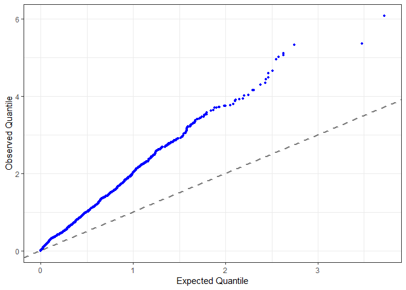

:speech\_balloon: *How do you interpret the deviation from the diagonal?*

Multiple hypothesis testing
---------------------------

The more compounds we test, the more chances we have to find a low p-value by chance. For example, when we run the test just one time, we are unlikely to find a p &lt; 1% by chance, whereas if we run the test 100 times, we are likely to find at least one p &lt; 1% by chance. This problem is called the multiple hypothesis testing.

It is possible to adjust the p-values to correct for multiple hypothesis testing. This can be done using the `p.adjust` function of the stats package. Note that numerous methods were established to correct for multiple hypothesis testing. The simplest approach is to multiply the p-values by the number of tests, called a *Bonferroni* correction. It is also possible to control the expected share of incorrect findings among the significant results, a False Discovery Rate (FDR). This is called a *Benjamini and Hochberg* correction, "BH", [(5)](#references).

``` r
proteinGroups$bonferroniPValue <- p.adjust(proteinGroups$pValue, method = "bonferroni")
proteinGroups$bhFDR <- p.adjust(proteinGroups$pValue, method = "BH")

proteinGroups$bonferroniPValue_log <- -log10(proteinGroups$bonferroniPValue)
proteinGroups$bhFDR_log <- -log10(proteinGroups$bhFDR)

bhPlot <- ggplot() + 
    geom_line(data = proteinGroups, aes(x = pValue_log, y = bonferroniPValue_log), col="red", alpha = 0.8) + 
    geom_line(data = proteinGroups, aes(x = pValue_log, y = bhFDR_log), col="blue", alpha = 0.8) + 
    xlab("Original p-value") + ylab("Bonferroni p-value (red) - BH FDR (blue) [-log10]")

plot(bhPlot)
```

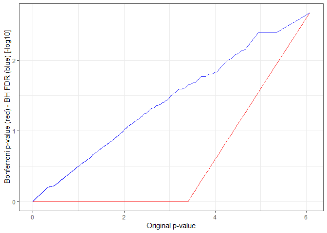

This is how the Volcano plot looks like after BH correction.

``` r
volcanoPlot <- ggplot() +
    geom_point(data = proteinGroups, mapping = aes(x = foldChange, y = bhFDR_log, col = Species), alpha = 0.2) +
    geom_hline(yintercept = -log10(0.05), col = "darkgreen", linetype = "dashed") +
    scale_color_manual(values = c("red3", "black"))

plot(volcanoPlot)
```

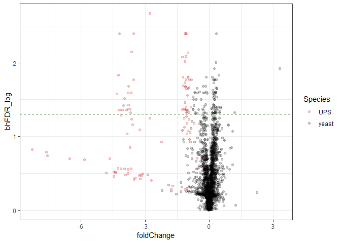

:pencil2: Count the number of yeast and UPS protein groups with FDR &lt; 0.05.

:speech\_balloon: *What do you think about the new threshold?*

Independent weighting hypothesis
--------------------------------

Here, we hypothesize that false positives are likely to be the ones with the lowest difference between *A* and *B*. In order to reduce the prevalence of false positives in the results, it is common to retain only protein groups with a fold change above an arbitrary threshold, typically 2.

``` r
volcanoPlot <- ggplot() +
    geom_point(data = proteinGroups, mapping = aes(x = foldChange, y = bhFDR_log, col = Species), alpha = 0.2) +
    geom_hline(yintercept = -log10(0.05), col = "darkgreen", linetype = "dashed") +
    geom_vline(xintercept = -1, col = "darkgreen", linetype = "dashed") +
    geom_vline(xintercept = 1, col = "darkgreen", linetype = "dashed") +
    scale_color_manual(values = c("red3", "black"))

plot(volcanoPlot)
```

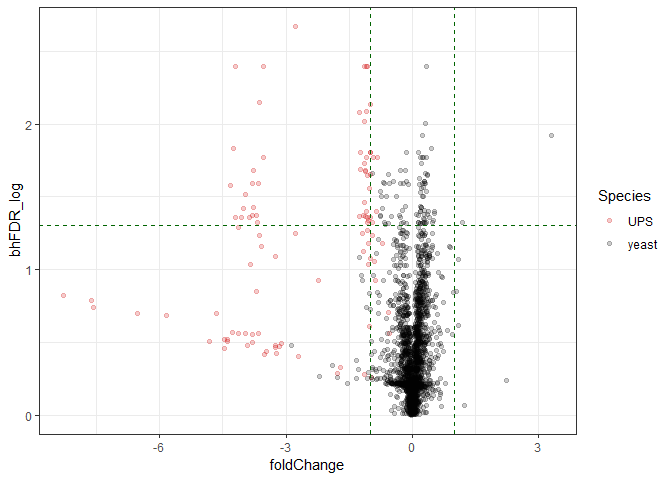

Note that we are here using arbitrary thresholds that conveniently give good results, but we have no control on the error rate. You will find numerous attempts at doing independent weighting hypothesis (IWH) in the literature. Notably, Perseus implements a permutation-based approach with very good performance. You might also want to try the [IHW package](http://bioconductor.org/packages/devel/bioc/vignettes/IHW/inst/doc/introduction_to_ihw.html) of bioconductor.

:pencil2: Count the number of yeast and UPS protein groups with FDR &lt; 0.05 and fold change lower than 0.5 or higher than 2. If we use these selection criteria, can you evaluate the false positive and false negative rates based on the number of yeast and UPS proteins?

:speech\_balloon: *How can we improve our control of the FDR, and improve our power?*

References
----------

1.  [MaxQuant enables high peptide identification rates, individualized p.p.b. range mass accuracies and proteome-wide protein quantification](https://www.ncbi.nlm.nih.gov/pubmed/19029910)
2.  [ProteomeXchange provides globally coordinated proteomics data submission and dissemination](https://www.ncbi.nlm.nih.gov/pubmed/24727771)
3.  [PRIDE: the proteomics identifications database](https://www.ncbi.nlm.nih.gov/pubmed/16041671)
4.  [Benjamini, Y. and Hochberg, Y., *Controlling the false discovery rate: a practical and powerful approach to multiple testing*, Journal of the Royal Statistical Society, 1995](http://www.math.tau.ac.il/~ybenja/MyPapers/benjamini_hochberg1995.pdf)
