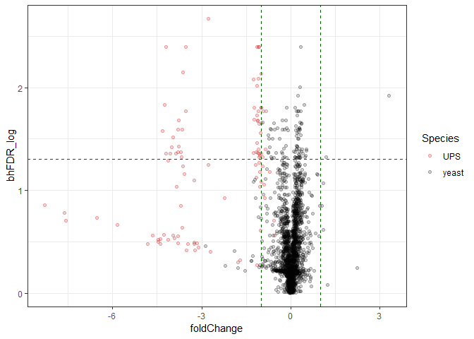
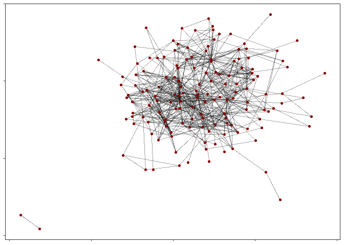

# Bioinformatics tutorials

This folder contains bioinformatics tutorials used for teaching. Just like you need to adapt your protocol to your sample, there is not a one workflow fits all when it comes to data interpretation. The scripts proposed here are not to be blindly copy-pasted, but aim at introducing basic methods. You can use some of the tutorials as cheat sheet when developing your own scripts.

The tutorials are provided without guarantee using simple example datasets. Hopefully you will find them useful. If you have suggestions and comments, please post them on the [issue tracker](https://github.com/mvaudel/tutorials/issues). I will extend the tutorials according to your feedback.

## Legend

You will find the following icons throughout the text:

* :pencil2: : You need to do something
* :thought_balloon: : A question to trigger your attention on an important point of detail. Clicking the icon takes you to the answer.
* :speech_balloon: : Something you might want to discuss with someone else (or yourself).

## Proteomics Data

This short [tutorial](Proteomics_data/proteomics_data.md) introduces mass spectrometry based proteomics data and gives a quick glance at a raw file taken from ProteomeXchange.

## Proteomics Identification

This short [tutorial](Proteomics_identification/proteomics_identification.md) gives a tour on identification results.

## Reporter ions

This short [tutorial](Reporter_ions/4.2-Reporter-Ions.pdf) on reporter ions quantification is taken from the [Compomics tutorials](https://compomics.com/bioinformatics-for-proteomics/quantification/). The PeptideShaker results can be found [here](Reporter_ions/Reporter_tutorial.zip) and the Reporter tool [here](Reporter-0.7.11.zip).

## Proteomics Quantification

This short [tutorial](Proteomics_quantification/quantitative_proteomics.md) takes you through the processing of label free proteomics quantitative data. Many of the methods introduced can be reused with other types of quantitative data.

## Functional resources

This short [tutorial](Functional_resources/functional_resources.md) queries Reactome and String using a set of genes.

