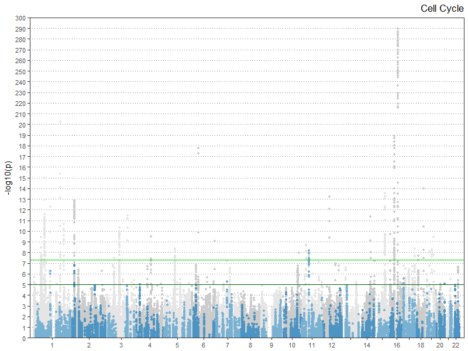
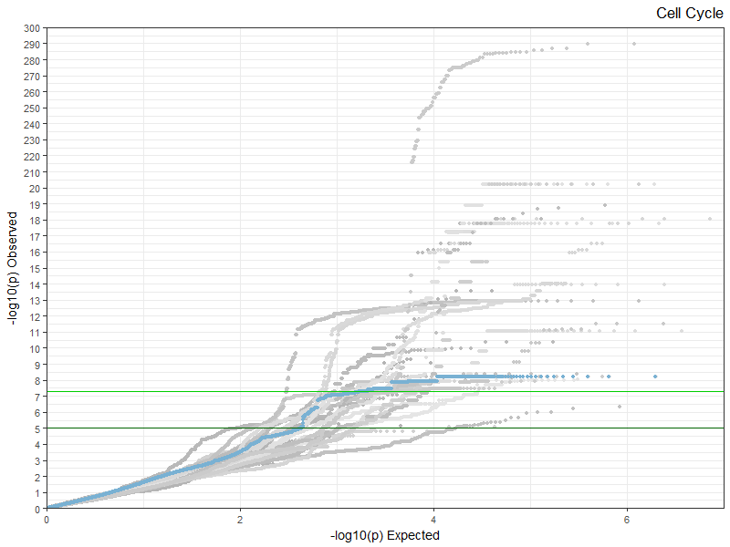
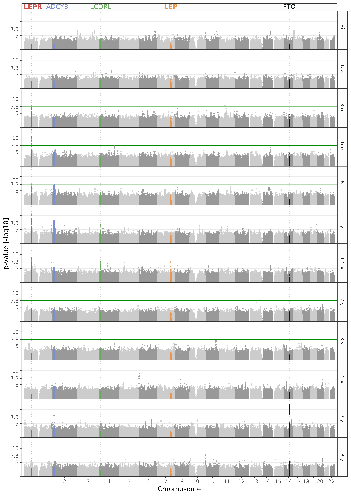
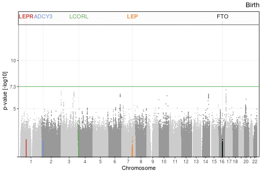

```{r setup, include=FALSE}
knitr::opts_chunk$set(echo = TRUE)
```

Manhattan and QQ plots are used to interpret the results of genome-wide association studies (GWASs). Here we build animated gifs based on multiple Manhattan or QQ plots.

## Coloring based on effect on pathways

In this section, we color the Manhattan based on possible effect on pathways, like done in the plots below. 





As an example, We are going to use the results of association with BMI from the GIANT consortium. Note that here we retain only SNPs with an rs ID, and that this data set contains exome markers only.

```{r input_giant}

# Read table
giantData <- read.table(file = "resources/bmi_p-values.gz", header = T, stringsAsFactors = F, sep = "\t")

# Select markers and columns of interest
giantData <- giantData[giantData$SNPNAME != '-' & !is.na(giantData$Pvalue), c("CHR", "POS", "SNPNAME", "Pvalue")]

# Formatting
names(giantData) <- c("chr", "bp", "id", "p")
giantData$p <- -log10(giantData$p)


```

A Manhattan plot displays the p-value of an association against the genomic coordinates of markers. Many packages allow drawing these, and it is quite straightforward to do using [ggplot2](https://ggplot2.tidyverse.org/). When building the plot, we will use colors to highlight specific features. Choosing colors is [less trivial than it seems](https://serialmentor.com/dataviz/color-pitfalls.html), we will use the [scico](https://github.com/thomasp85/scico) package, that is built on [palettes developed by Fabio Crameri](http://www.fabiocrameri.ch/colourmaps.php).

:pencil2: Install the packages if needed, and load them.

```{r packages}

# install packages if needed
# install.packages("ggplot2")
# install.packages("scico")

# Load packages
library(ggplot2)
library(scico)

# Set ggplot theme once and for all
theme_set(theme_bw(base_size = 11))

```

The first thing that we will need to do to build a Manhattan plot is to convert variant chromosomic coordinates into coordinates that can be aligned on an axis. For this we need to know the size of each chromosome. This can easily be obtained from [Ensembl](http://grch37.ensembl.org/Homo_sapiens/Location/Chromosome?r=1), just note that these are obviously assembly specific.

```{r chr_lengths}

# Chromosome lengths in GRCh37.p13 (hg19) from Ensembl
chromosomes <- c("1", "2", "3", "4", "5", "6", "7", "8", "9", "10", "11", "12", "13", "14", "15", "16", "17", "18", "19", "20", "21", "22", "X")
chromosomeLength <- c(249250621, 243199373, 198022430, 191154276, 180915260, 171115067, 159138663, 146364022, 141213431, 135534747,	135006516, 133851895, 115169878, 107349540, 102531392, 90354753, 81195210, 78077248, 59128983, 63025520, 48129895, 51304566, 	155270560)
genomeLength <- sum(chromosomeLength)

# Factor and sort markers
giantData$chr <- factor(giantData$chr, levels = chromosomes)
giantData <- giantData[order(giantData$chr, giantData$bp), ]


```

In order to be able to customize the plot, we write a function that produces a Manhattan plot from an association data frame.

```{r mh_function}

#' Returns a ggplot object with the MH for the given association data frame.
#' 
#' @param associationDF data frame containing the results of the association
#' @param annotatedIds list of ids to annotate
#' @param chrColumn name of the chromosome column
#' @param bpColumn name of the chromosomic coordinates column
#' @param idColumn name of the ids column
#' @param pColumn name of the log-transformed p-values column
#' @param snpColors vector of two colors to use for markers alternatively on chromosomes
#' @param annotationColor color to use for annotated markers
#' @param maxP the maximal p-value used to scale the y axis
#' @param threshold the p-value threshold to display
#' @param thresholdColor the color to use for the threshold
#' 
#' @return a ggplot object of the MH
getMh <- function(
  associationDF, 
  annotatedIds = NULL,
  chrColumn = "chr", 
  bpColumn = "bp", 
  idColumn = "id", 
  pColumn = "p", 
  snpColors = scico(n = 2, begin = 0.2, end = 0.4, palette = "grayC"), 
  annotationColor = scico(n = 1, begin = 0.8, end = 0.8, palette = "grayC"), 
  maxP = max(associationDF[[pColumn]]),
  threshold = -log10(5e-8),
  thresholdColor = "green4") {
  
  # Chromosome coordinates 
  chromosomeStart <- cumsum(chromosomeLength) - chromosomeLength
  chromosomeMiddle <- chromosomeStart + chromosomeLength / 2
  
  # Make data frame for plotting
  plotDF <- data.frame(chr = associationDF[[chrColumn]],
                       bp = associationDF[[bpColumn]],
                       id = associationDF[[idColumn]],
                       p = associationDF[[pColumn]],
                       stringsAsFactors = F)
  
  # Get genomic coordinates
  plotDF$x <- chromosomeStart[plotDF$chr] + plotDF$bp
  
  # X-axis labels
  xLabels <- chromosomes
  xLabelsI <- 1:length(xLabels)
  xLabels[xLabelsI %% 2 == 0 & xLabelsI > 17] <- ""
  
  # Set colors
  plotDF$color <- ifelse(as.numeric(plotDF$chr) %% 2 == 0, snpColors[1], snpColors[2])
  plotDF$color <- factor(plotDF$color, levels = snpColors)
  
  # Separate background and annotation
  annotatedI <- !is.null(annotatedIds) & plotDF$id %in% annotatedIds
  backgroundDF <- plotDF[!annotatedI, ]
  annotationDF <- plotDF[annotatedI, ]
  
  # Make plot
  mhPlot <- ggplot() + 
    
    geom_hline(yintercept = threshold, col = thresholdColor, size = 0.3) + 
    geom_point(data = backgroundDF, mapping = aes(x = x, y = p, col = color), alpha = 0.8, size = 1, stroke = 0, shape = 16) + 
    geom_point(data = annotationDF, mapping = aes(x = x, y = p), col = annotationColor, alpha = 0.8, size = 1, stroke = 0, shape = 16) + 
    
    scale_x_continuous(name = "Chromosome", breaks = chromosomeMiddle, labels = xLabels, limits = c(0, genomeLength), expand = c(0.01, 0.01)) + 
    scale_y_continuous(name = "p-value [-log10]", expand = c(0, 0), limits = c(0, 1.05 * maxP)) + 
    scale_color_manual(values = snpColors) + 
    
    theme(legend.position = "none",
          panel.grid.minor = element_blank(),
          panel.grid.major.x = element_blank(),
          panel.grid.major.y = element_line(size = 0.3))
  
  return(mhPlot)
  
}

```

As an example, we make a Manhattan plot and highlight variants reaching p < 5e-8.

```{r mh_giant}
# Make plot with annotation of markers over a threshold of -log10(5e-8)
annotatedIds <- giantData$id[giantData$p > -log10(5e-8)]
mhPlot <- getMh(associationDF = giantData, annotatedIds = annotatedIds)

plot(mhPlot)

```


### Pathway matching

In order to speculate on the effect of variants on pathways, the effect of genetic variants on proteins is first inferred using Ensembl Variant Effect Predictor, [VEP](http://www.ensembl.org/info/docs/tools/vep/index.html), and then the participation of proteins in pathways is inferred using [Reactome](https://reactome.org). This analysis can readily be conducted using [PathwayMatcher](https://github.com/PathwayAnalysisPlatform/PathwayMatcher).

:pencil2: Extract the ids of the variants to match in a single file.

```{r input}

writeLines(giantData$id, "snps.txt")

```

:pencil2: If it is not done already, install PathwayMatcher. The easiest is to do it using Bioconda.

```

conda install -c bioconda pathwaymatcher

```

:pencil2: Run PathwayMatcher on the snp list produced previously. Note that the command below is for use _via_ bioconda.

```

pathwaymatcher -i snps.txt -t rsid -o outputFolder -tlp

```

PathwayMatcher should produce two files named _analysis.tsv_ and _search.tsv_. The search file contains the snp to pathway mapping. Note that these files can be found in the _resources_ folder.

:pencil2: Load the _search.tsv_ file.

```{r input_pathways}

# Read table
pathwaysDF <- read.table(file = "resources/search.tsv.gz", header = T, stringsAsFactors = F, sep = "\t", quote = "", comment.char = "")

# Select columns of interest
pathwaysDF <- pathwaysDF[, c("RSID", "PATHWAY_DISPLAY_NAME", "TOP_LEVEL_PATHWAY_DISPLAY_NAME")]
names(pathwaysDF) <- c("id", "pathway", "topPathway")

# Get pathways
pathways <- unique(pathwaysDF$pathway)
topLevelPathways <- unique(pathwaysDF$topPathway)

# Extract number of pathways
nPathways <- length(pathways)
nTopLevelPathways <- length(topLevelPathways)
print(paste("Number of top level pathways: ", nTopLevelPathways))
print(paste("Number of pathways: ", nPathways))

```


### Pathway order

In the following, in order to get a global view of manageable size on our data set, we focus on top level pathways. 

:pencil2: Look at the number of common markers between top-level pathways.

```{r pathways_dist}

# Get the number of markers mapped to each pathway

pathwaySnps <- list()

for (i in 1:nTopLevelPathways) {
  
  pathwayI <- topLevelPathways[i]
  pathwaySnps[[i]] <- unique(pathwaysDF$id[pathwaysDF$topPathway == pathwayI])
  
}

# Make a matrix of number of shared markers
pathwayOverlap <- matrix(nrow = nTopLevelPathways, ncol = nTopLevelPathways, data = 0, dimnames = list(topLevelPathways, topLevelPathways))
diag(pathwayOverlap) <- 1

for (i in 1:(nTopLevelPathways-1)) {
  for (j in (i+1):nTopLevelPathways) {
    
    pathwayI <- topLevelPathways[i]
    pathwayJ <- topLevelPathways[j]
    
    pathwaySnpsI <- pathwaySnps[[i]]
    pathwaySnpsJ <- pathwaySnps[[j]]
    
    nI <- length(pathwaySnpsI)
    nJ <- length(pathwaySnpsJ)
    
    nIJ <- sum(pathwaySnpsI %in% pathwaySnpsJ)
    
    pathwayOverlap[i, j] <- nIJ / (nI + nJ - nIJ)
    pathwayOverlap[j, i] <- pathwayOverlap[i, j]
    
  }
}

```

If we want to plot this matrix with ggplot2, we need to convert this matrix where measured variables are spread over multiple columns into a single column representation. For this, we use the _reshape2_ package.

:pencil2: Install the package if needed, and load it

```{r reshape2}

# Install package if needed
# install.packages("reshape2")

# Load package
library(reshape2)

```

We now make a function that produces a heatmap from such a matrix.

```{r heatmap_function}

#' Returns a ggplot object with the data frame plotted as heatmap.
#' 
#' @param matrix the matrix
#' @param labels an ordered vector of labels
#' 
#' @return a ggplot object of the heatmap
getHeatMap <- function(
  matrix, 
  labels = row.names(pathwayOverlap),
  palette = "cork") {
  
  # Format matrix into a data frame
  df <- melt(matrix)
  names(df) <- c("x", "y", "z")
  df$x <- factor(df$x, levels = labels)
  df$y <- factor(df$y, levels = labels)
  
  
  # Make plot
  heatMap <- ggplot() + 
    
    geom_tile(data = df, mapping = aes(x = x, y = y, fill = z)) + 
    
    scale_x_discrete(expand = c(0, 0), position = "top") + 
    scale_y_discrete(expand = c(0, 0)) + 
    scale_fill_scico(palette = palette, begin = 0.5) +
    
    theme(legend.position = "none",
          panel.grid.minor = element_blank(),
          panel.grid = element_blank(),
          axis.title = element_blank(),
          axis.text.x = element_text(angle = 90, hjust = 0, vjust = 0.5))
  
  return(heatMap)
  
}

```

:pencil2: Plot the heatmap.

```{r heatmap}

# plot heatmap
heatMap <- getHeatMap(matrix = pathwayOverlap)

plot(heatMap)

```

In the following, we are going to use the pathway overlap as a measure of the distance between pathways, and run hierarchical clustering on pathways. Hence, we order the pathways based on their overlapping SNP.

```{r clustering}

# Make distance matrix
pathwayDist <- 1 - pathwayOverlap

# Cluster
pathwayClust <- hclust(as.dist(pathwayDist))
orderedPathways <- topLevelPathways[pathwayClust$order]

# plot heatmap
heatMap <- getHeatMap(matrix = pathwayOverlap, labels = orderedPathways)

plot(heatMap)


```


### Pathway MH

In the following, we plot again the Manhattan, but we color the markers matching the different pathways one after the other. For this, we create an animation using the [_gganimate_](https://github.com/thomasp85/gganimate) package.

:pencil2: Install the package if needed, and load it. Note that _gganimate_ is not in CRAN so you need to install it from GitHub. See the [_gganimate_](https://github.com/thomasp85/gganimate) website for more details.

```{r gganimate}

# Load package
library(gganimate)

```

Now, we extend the Manhattan plot function to create the animation.

```{r animated_mh}

#' Returns a gganimate object with the MH for the given association data frame.
#' 
#' @param associationDF data frame containing the results of the association
#' @param pathwaysDF pathway matching data frame
#' @param orderedPathways an ordered vector of pathways
#' @param chrColumn name of the chromosome column
#' @param bpColumn name of the chromosomic coordinates column
#' @param idColumn name of the ids column
#' @param pColumn name of the log-transformed p-values column
#' @param pathwayColumn name of the pathway column
#' @param snpColors vector of two colors to use for markers alternatively on chromosomes
#' @param annotationColor color to use for annotated markers
#' @param maxP the maximal p-value used to scale the y axis
#' @param threshold the p-value threshold to display
#' @param thresholdColor the color to use for the threshold
#' 
#' @return a ggplot object of the MH
getAnimatedMh <- function(
  associationDF, 
  pathwaysDF,
  orderedPathways,
  chrColumn = "chr", 
  bpColumn = "bp", 
  idColumn = "id", 
  pColumn = "p", 
  pathwayColumn = "topPathway",
  snpColors = scico(n = 2, begin = 0.2, end = 0.4, palette = "grayC"), 
  annotationColor = scico(n = 1, begin = 0.8, end = 0.8, palette = "grayC"), 
  maxP = max(associationDF[[pColumn]]),
  threshold = -log10(5e-8),
  thresholdColor = "green4",
  pathwayPalette = "batlow") {
  
  # Chromosome coordinates 
  chromosomeStart <- cumsum(chromosomeLength) - chromosomeLength
  chromosomeMiddle <- chromosomeStart + chromosomeLength / 2
  
  # Make data frame for plotting
  baseDF <- data.frame(chr = associationDF[[chrColumn]],
                       bp = associationDF[[bpColumn]],
                       id = associationDF[[idColumn]],
                       p = associationDF[[pColumn]],
                       stringsAsFactors = F)
  
  # Get genomic coordinates
  baseDF$x <- chromosomeStart[baseDF$chr] + baseDF$bp
  
  # Set base colors
  baseDF$color <- ifelse(as.numeric(baseDF$chr) %% 2 == 0, snpColors[1], snpColors[2])
  
  # Get pathway colors
  pathwayColors <- scico(n = length(orderedPathways), palette = pathwayPalette)
  
  # Make one data frame per pathway with colored markers and merge them
  pathwayDFs <- list()
  for (i in 1:length(orderedPathways)) {
    
    pathway <- orderedPathways[i]
    pathwayColor <- pathwayColors[i]
    
    pathwayDF <- baseDF
    pathwayDF$pathway <- pathway
    
    matchedIds <- unique(pathwaysDF$id[pathwaysDF[[pathwayColumn]] == pathway])
    pathwayDF$color[pathwayDF$id %in% matchedIds] <- pathwayColor
    
    pathwayDFs[[i]] <- pathwayDF
    
  }
  plotDF <- do.call("rbind", pathwayDFs)
  
  # Factor the colors and pathways, and sort the data frame with the annotated SNPs in the front
  plotDF$pathway <- factor(plotDF$pathway, levels = orderedPathways)
  plotDF$color <- factor(plotDF$color, levels = c(snpColors, pathwayColors))
  plotDF <- plotDF[order(plotDF$pathway, plotDF$color, plotDF$x), ]
  
  # X-axis labels
  xLabels <- chromosomes
  xLabelsI <- 1:length(xLabels)
  xLabels[xLabelsI %% 2 == 0 & xLabelsI > 17] <- ""
  
  # Threshold DF
  thresholdDF <- data.frame(threshold = rep(threshold, length(orderedPathways)), pathway = orderedPathways, stringsAsFactors = F)
  thresholdDF$pathway <- factor(thresholdDF$pathway, levels = orderedPathways)
  
  # Make plot
  mhPlot <- ggplot() + 
    
    geom_hline(data = thresholdDF, mapping = aes(yintercept = threshold), col = thresholdColor, size = 0.3) + 
    geom_point(data = plotDF, mapping = aes(x = x, y = p, col = color, group = id), alpha = 0.8, size = 2, stroke = 0, shape = 16) + 
    
    scale_y_continuous(name = "p-value [-log10]", expand = c(0, 0), limits = c(0, 1.05 * maxP)) + 
    scale_x_continuous(name = "Chromosome", breaks = chromosomeMiddle, labels = xLabels, limits = c(0, genomeLength), expand = c(0.01, 0.01)) + 
    scale_color_manual(values = c(snpColors, pathwayColors)) + 
    
    ggtitle("{closest_state}") +
    
    theme(legend.position = "none",
          panel.grid.minor = element_blank(),
          panel.grid.major.x = element_blank(),
          panel.grid.major.y = element_line(size = 0.3),
          plot.title = element_text(hjust = 1)) +
    
    transition_states(states = pathway, transition_length = 3, state_length = 5) +
    enter_fade() +
    exit_fade()
  
  return(mhPlot)
  
}

```

The animation can be started using `animate()` or saved to file using `anim_save()`. Note that the computation of the animation requires quite some memory and might not work on a standard desktop computer. Running the code below on this example failed on a server with ~64 GB of RAM but worked with ~128 GB and took two hours to encode.

```

animatedMH <- getAnimatedMh(associationDF = giantData, pathwaysDF = pathwaysDF, orderedPathways = orderedPathways)

animate(animatedMH, nframes = 500, height = 450, width = 800)
anim_save(filename = "pathwayMh.gif", path = "plots")

```


The resulting animation colors markers based on predicted effect on pathways. It can help classifying variants and loci, or select pathways worth investing their sub-pathways for relevant functional information. 

The strongest association on chromosome 16 is the FTO locus, a textbook example of the limitations of this approach: it is colored according to the pathways involving the protein coded by the FTO gene, _Alpha-ketoglutarate-dependent dioxygenase FTO_ accession Q9C0B1. These pathways are all involved in _DNA Repair_. However, there is compelling evidence that the variants in the FTO locus are influenceing BMI through complex and long-range interaction with other genes [(1)](#references). The biochemical mechanism underlying the BMI increase may therefore have nothing to do with _DNA Repair_. This example shows that our understanding of the effect of variants on genes, proteins, and pathways is very limited, and the results of such analyses must be interpreted with the greatest care.


## Time-lapse MH

In this section, we draw an animated Manhattan plot based on whole genome variants. In this example, we use the association results with BMI over the first years of life. We combine the figure below (Supplementary Figure 1 of [this preprint](https://www.biorxiv.org/content/early/2018/11/25/478255)) into a single animation.



In the previous section, we were already struggling with memory consumptions with approximately 200,000 points, here each plot contains several millions of points, so we need to look towards an alternative solution to _gganimate_. In order to keep the memory consumption as low as when making the figure above, we compute export the different frames one by one on the fly. This is made simple by the fact that Manhattan plots of the same markers all display the same points, we thus just need to move them up and down. 

The code below shows how the animation was made, note that I was not allowed to share the code I wrote to produce the figure above or the underlying data, so here is only the part that builds the animation. I will be happy to answer questions and comments on the [issue tracker](https://github.com/mvaudel/tutorials/issues). In short, we iterate all states of the MH and build transitions between them, saving one frame at a time. While doing so, we build a command line that uses [magick](https://www.imagemagick.org/script/index.php) to combine all frames in a gif. This is approach less generic, elegant, and powerful than gganimate, but R used only 20 GB of RAM when creating the figure, and the entire process took less than a day.

```

#' Returns a data frame corresponding to the iterpolation between the MHs at two ages.
#' 
#' @param associationDF Association data frame at a given age with id, chr, pos, and p
#' @param age0 the reference age
#' @param age1 the next age
#' @param x the level of interpolation between 0 and 1
#' 
#' @return a grob of the stacked MHs with annotation
getInterpolation <- function(associationDF, age0, age1, x) {
    
    associationDF0 <- associationDF[associationDF$age == age0, c("id", "chr", "pos", "p")]
    names(associationDF0) <- c("id", "chr", "pos", "p0")
    
    associationDF1 <- associationDF[associationDF$age == age1, c("id", "p")]
    names(associationDF1) <- c("id", "p1")
    
    associationDFI <- merge(associationDF0, associationDF1, by = "id")
    
    associationDFI$deltaP <- associationDFI$p1 - associationDFI$p0
    
    associationDFI$easeP <- easing(x) * associationDFI$deltaP # Here as easing function I used tanh
    
    associationDFI$p <- associationDFI$p0 + associationDFI$easeP
    
    associationDFI <- associationDFI[, c("id", "chr", "pos", "p")]
    
    return(associationDFI)
    
}

# Export frames

print(paste(Sys.time(), " Building plot", sep = ""))

maxP <- max(associationDF$p, -log10(5e-8))

gifCommand <- "convert" # Note: for windows you might need to add path\magick.exe at the beginning

for (i in 1:length(mhIndexes)) { # mhIndexes is the number of states to plot
    
    associationDFI <- associationDF[associationDF$age == i, ] # here associationDF contains the association result, selecting a given age returns an MH at a given age
    
    plotGrob <- getMhGrob(associationDF = associationDFI, topHitsDF = topHitsDF, maxP = maxP, title = timePoints[i], titleColor = "black") # This builds an mh at a given age
    
    # Export frame
    
    imagePath <- file.path(tempFolder, paste0(ageI, ".png"))
    
    png(filename = imagePath, pointsize = 12, height = gifHeight, width = gifWidth, units = gifUnit, res = gifResolution)
    grid.draw(plotGrob)
    dummy <- dev.off()
    
    # Add the frame to the command
    
    gifCommand <- paste(gifCommand, "-delay", "100", imagePath, sep = ' ') # The delay function sets how long the frame will be displayed.
    
    
    # If before the last, make transition frames
    
    if (i < length(zbmiIndexes)) {
        
        for (j in 1:19) { # We use 19 transition frames
            
            if (j <= 10) {
                
                title <- timePoints[i]
                
            } else {
                
                title <- timePoints[i+1]
                
            }
            
            x <- j / 20
            
            associationDFI <- getInterpolation(associationDF = associationDF, age0 = ageI, age1 = ageIPlusOne, x = x) # This function interpolates the p-values between time points.
            
            plotGrob <- getMhGrob(associationDF = associationDFI, topHitsDF = topHitsDF, maxP = maxP, title = title, titleColor = titleGradient[j]) # Plot the interpolated MH. The title switches from previous to next age following a black-white-black gradient during the transition.
    
            # Export frame
            
            imagePath <- file.path(tempFolder, paste0(ageI, "_", j, ".png"))
            
            png(filename = imagePath, pointsize = 12, height = gifHeight, width = gifWidth, units = gifUnit, res = gifResolution)
            grid.draw(plotGrob)
            dummy <- dev.off()
    
            # Add the frame to the command
            
            gifCommand <- paste(gifCommand, "-delay", "0.5", imagePath, sep = ' ')
            
        }
    }
}

# Set output file

outputFile <- file.path(plotFolder, "mh_time-lapse.gif")

gifCommand <- paste(gifCommand, "-loop", "1", outputFile, sep = ' ')


## Build gif

print(paste(Sys.time(), " Building gif", sep = ""))

system(gifCommand) # This executes the magick command

```



Please note that the gif above is released under CC-BY with the same authors as [this preprint](https://www.biorxiv.org/content/early/2018/11/25/478255).


## References

(1) [Scrutinizing the FTO locus: compelling evidence for a complex, long-range regulatory context](https://www.ncbi.nlm.nih.gov/pubmed/26340902)

