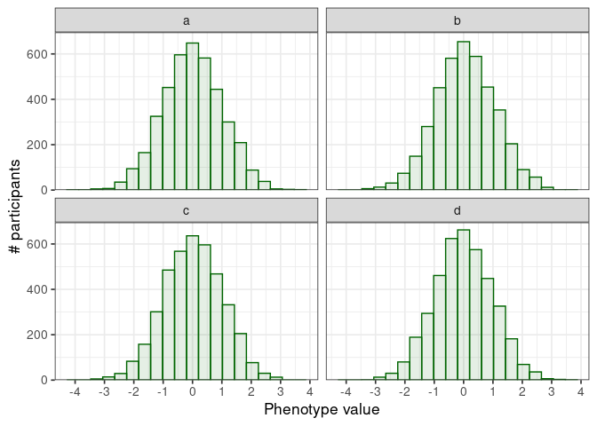
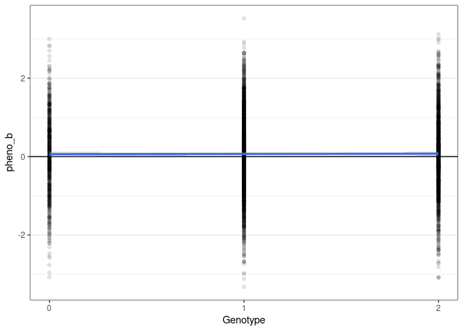

## GWAS data introduction and QC

This notebook provides and introduction to conducting genome-wide
association studies.

## Libraries

We will need the following libraries. If they are not availble on your
system, use the `ìnstall_packages` command to install them.

    library(janitor) # A package to clean dirty data

    ## 
    ## Attaching package: 'janitor'

    ## The following objects are masked from 'package:stats':
    ## 
    ##     chisq.test, fisher.test

    library(tidyr) # A package to tidy data
    library(dplyr) # A package to manipulate data

    ## 
    ## Attaching package: 'dplyr'

    ## The following objects are masked from 'package:stats':
    ## 
    ##     filter, lag

    ## The following objects are masked from 'package:base':
    ## 
    ##     intersect, setdiff, setequal, union

    library(parallel) # A package to run tasks in parallel
    library(glue) # A package to glue variables in strings

    library(ggplot2) # A package to plot data

    library(conflicted) # A package to manage namespace conflicts

    # Resolve conflicting function names
    conflict_prefer("filter", "dplyr")

    ## [conflicted] Will prefer dplyr::filter over any other package

    # Set the theme for plots
    theme_set(theme_bw(base_size = 13))

## Load data

Load the example data available at this
[link](https://drive.google.com/file/d/1hdESYbyRrfBZALTgV3h4TSJ82Od-bShv/view?usp=sharing).

    file_path <- "/home/marc/Projects/tutorials/data/lm_example.gz"

    start_time <- Sys.time()

    snp_data <- read.table(
      file = file_path,
      sep = "\t",
      header = T,
      stringsAsFactors = F
    ) %>% 
      clean_names()

    end_time <- Sys.time()

    processing_time <- difftime(end_time, start_time)

    phenotypes <- c("pheno_a", "pheno_b", "pheno_c", "pheno_d")

The file was imported in 1.1 mins\`.

*How can we reduce the time spent reading files?*

This data set, courtesy of Dr. Bram Burger, contains simulated genotypes
and phenotypes as a table: - chromosome: the chromosome where the
variant is located - position: the position of the variant, here we have
only one variant per position - genotype: the number of alternative
alleles for a given variant in a given individual - sample: the
identifier of the individual - pheno\_x: the phenotypic values

There is one variant at every genomic position, making 1756 variants for
4000 individuals.

*How does this compare to GWAS studies you might have seen in the
literature? How long would it take to load a similar file containing ten
million variants?*

## Genotypes

Select a position, for the variant at this position, compute the number
of participants with a given genotype.

    sampled_position <- sample(snp_data$position, 1)

    pos_data <- snp_data %>% 
      filter(
        position == sampled_position
      )

    print(
      glue("# Number of participants for a given genotype for the variant at position {sampled_position}")
    )

    ## # Number of participants for a given genotype for the variant at position 37611987

    table(pos_data$genotype)

    ## 
    ##    0    1    2 
    ## 1406 1959  635

Estimate the alternative allele frequency: 40.4 %.

Load summary information on the variants in one chromosome of MoBa
available at this
[link](https://drive.google.com/file/d/1yOumgGsa8u3w0C6F58MQAyQdhL756ChJ/view?usp=sharing).

    file_path <- "/home/marc/Projects/tutorials/data/22-markerinfo.gz"

    marker_info <- read.table(
      file = file_path,
      sep = "\t",
      header = F,
      stringsAsFactors = F
    ) %>% 
      clean_names()

    names(marker_info) <- c("chromosome", "position", "id", "ref", "alt", "typed", "info", "ref_panel_af")

*What is the content of the different columns?*

Compute the share of genotyped markers.

    n_genotyped <- sum(marker_info$typed == 1)

    total <- nrow(marker_info)

    share_genotyped <- round(100 * n_genotyped / total, 1)

    print(glue("{n_genotyped} markers of {total} are genotyped ({share_genotyped} %)"))

    ## 18541 markers of 524544 are genotyped (3.5 %)

*How can we conduct genome-wide analyses when probing only 3.5 variants?
How will this influence our results?*

Build a histogram of info scores for non-genotyped markers.

    non_genotyped_marker_info <- marker_info[marker_info$typed != 1, ]

    ggplot() +
      geom_histogram(
        data = non_genotyped_marker_info,
        mapping = aes(
          x = info
        ),
        col = "darkred",
        fill = "darkred",
        alpha = 0.1,
        bins = 20
      ) +
      scale_x_continuous(
        name = "Info score"
      ) +
      scale_y_continuous(
        name = "# variants",
        expand = expansion(
          mult = c(0, 0.05)
        )
      )

*How would you use this variable to remove low quality markers?*

Compute the minor allele frequency in the reference panel, and build a
histogram.

    non_genotyped_marker_info <- non_genotyped_marker_info %>% 
      mutate(
        minor_allele_frequency = 100 * ifelse(ref_panel_af > 0.5, 1 - ref_panel_af, ref_panel_af)
      )

    ggplot() +
      geom_histogram(
        data = non_genotyped_marker_info,
        mapping = aes(
          x = minor_allele_frequency
        ),
        col = "darkblue",
        fill = "darkblue",
        alpha = 0.1,
        bins = 20
      ) +
      scale_x_continuous(
        name = "Minor allele frequency [%]"
      ) +
      scale_y_continuous(
        name = "# variants",
        expand = expansion(
          mult = c(0, 0.05)
        )
      )

*How does this compare to the histogram obtained previously?*

Plot the info score against the minor allele frequency.

    ggplot() +
      geom_point(
        data = non_genotyped_marker_info,
        mapping = aes(
          x = minor_allele_frequency,
          y = info
        ),
        alpha = 0.1
      ) +
      scale_x_continuous(
        name = "Minor allele frequency [%]"
      ) +
      scale_y_continuous(
        name = "Info score"
      )

*Can you explain this trend? Which markers would you keep for a GWAS?*

## Phenotypes

*What kind of variables can be used for phenotypes in GWASes?*

Build a histogram of the different phenotypes available in this data
set.

    pheno_data <- pos_data %>% # The phenotypes are the same for all variants, we just need the data from one of them
      pivot_longer(
        cols = starts_with("pheno_"),
        names_prefix = "pheno_"
      ) %>% 
      select(
        sample, pheno = name, value
      )

    ggplot() +
      geom_histogram(
        data = pheno_data,
        mapping = aes(
          x = value
        ),
        col = "darkgreen",
        fill = "darkgreen",
        alpha = 0.1,
        bins = 20
      ) +
      scale_x_continuous(
        name = "Phenotype value",
        breaks = c(-5:5)
      ) +
      scale_y_continuous(
        name = "# participants",
        expand = expansion(
          mult = c(0, 0.05)
        )
      ) + 
      facet_wrap(
        ~ pheno
      )

*How do you interpret these distributions? How would you process
phenotypes prior to a GWAS?*

## Genotype to phenotype association

For the variant at the position selected below, look at the association
between `genotype` and `pheno_a`.

    association_results <- lm(
      data = pos_data,
      formula = pheno_a ~ genotype
    )

    print(
      glue("# Association results at position {sampled_position}")
    )

    ## # Association results at position 37611987

    summary(association_results)

    ## 
    ## Call:
    ## lm(formula = pheno_a ~ genotype, data = pos_data)
    ## 
    ## Residuals:
    ##     Min      1Q  Median      3Q     Max 
    ## -3.8509 -0.6752  0.0062  0.6743  3.2734 
    ## 
    ## Coefficients:
    ##             Estimate Std. Error t value Pr(>|t|)
    ## (Intercept) -0.03972    0.02451  -1.621    0.105
    ## genotype     0.02664    0.02311   1.153    0.249
    ## 
    ## Residual standard error: 1.005 on 3998 degrees of freedom
    ## Multiple R-squared:  0.0003323,  Adjusted R-squared:  8.225e-05 
    ## F-statistic: 1.329 on 1 and 3998 DF,  p-value: 0.2491

*How do you interpret these results? Is there a significant
association?*

Plot the phenotypes against genotypes at this position.

    ggplot() +
      theme_bw() +
      geom_hline(
        yintercept = 0
      ) +
      geom_point(
        data = pos_data,
        mapping = aes(
          x = genotype,
          y = pheno_a
        ),
        alpha = 0.1
      ) +
      geom_smooth(
        data = pos_data,
        mapping = aes(
          x = genotype,
          y = pheno_a
        ),
        method = "lm",
        formula = "y ~ x"
      ) +
      scale_x_continuous(
        name = "Genotype",
        breaks = c(0, 1, 2)
      ) +
      theme(
        panel.grid.major.x = element_blank(),
        panel.grid.minor.x = element_blank()
      )

*How would you expect the plot to look like for a significant
association?*

Run the association for all variants and all phenotypes.

    #' Run a linear model for the variant at the given position against the given phenotype.
    #' 
    #' @param position The position of the variant.
    #' @param snp_data The data frame containing the genotypes and phenotypes.
    #' @return The coefficients of the regression as a data frame.
    lm_function <- function(position, snp_data, pheno) {
      
      variant_data <- snp_data[snp_data$pos == position, ]
      
      lm_results <- lm(
        formula = glue("{pheno} ~ genotype"),
        data = variant_data
      )
      
      lm_summary <- summary(lm_results)
      
      coefficients <- data.frame(
        position = position,
        phenotype = pheno,
        beta = lm_summary$coef["genotype", "Estimate"],
        se = lm_summary$coef["genotype", "Std. Error"],
        p = lm_summary$coef["genotype", "Pr(>|t|)"],
        n = nrow(variant_data),
        stringsAsFactors = F
      )
      
      
      return(coefficients)
      
    }

    # Calculate the number of cores
    no_cores <- max(detectCores() - 1, 1)

    # Initiate a cluster to run functions on multiple cores
    cluster <- makeCluster(no_cores)

    clusterExport(cluster, "snp_data")
    clusterExport(cluster, "lm_function")
    clusterExport(cluster, "glue")

    # Process phenotypes one after the other

    start_time <- Sys.time()

    lm_results <- NULL

    for (phenotype in phenotypes) {
      
      print(glue("{Sys.time()} - Processing {phenotype}"))
      
      clusterExport(cluster, "phenotype")
      
      # Process variants in parallel
      
      pheno_results <- parLapply(
        cl = cluster, 
        X = sort(unique(snp_data$pos)), 
        fun = function (position) lm_function(position, snp_data, phenotype) 
      )
      
      # Merge into a single table
      
      pheno_results <- do.call("rbind", pheno_results)
      
      lm_results <- rbind(lm_results, pheno_results)
      
    }

    ## 2022-05-31 09:02:36 - Processing pheno_a
    ## 2022-05-31 09:03:14 - Processing pheno_b
    ## 2022-05-31 09:03:54 - Processing pheno_c
    ## 2022-05-31 09:04:34 - Processing pheno_d

    end_time = Sys.time()

    stopCluster(cluster)

    processing_time = difftime(end_time, start_time)

The analysis of these 1756 variants and 4 phenotypes using 15 threads
was conducted in 2.6 mins.

*How long would it take to process one phenotype over the entire genome?
How can we speed up this process?*

Plot the p-value against location for all phenotypes.

    lm_results$phenoFactor <- factor((lm_results$phenotype), levels = phenotypes)

    levels(lm_results$phenoFactor) <- c("a", "b", "c", "d")

    ggplot() +
      geom_point(
        data = lm_results,
        mapping = aes(
          x = position,
          y = -log10(p)
        )
      ) +
      scale_x_continuous(
        "Position [bp]"
      ) +
      scale_y_continuous(
        name = "p-value [-log10]",
        expand = expansion(
          mult = c(0, 0.1)
        )
      ) +
      facet_grid(
        phenotype ~ .
      )

Compute and plot the association of phenotype b with genotypes for the
variant of strongest association.

    best_pos <- lm_results$position[which.max(-log10(lm_results$p))]

    best_pos_data <- snp_data %>% 
      filter(
        position == best_pos
      )

    association_results <- lm(
      data = best_pos_data,
      formula = pheno_b ~ genotype
    )

    print(
      glue("# Association results at position {sampled_position}")
    )

    ## # Association results at position 37611987

    summary(association_results)

    ## 
    ## Call:
    ## lm(formula = pheno_b ~ genotype, data = best_pos_data)
    ## 
    ## Residuals:
    ##     Min      1Q  Median      3Q     Max 
    ## -3.3048 -0.6829 -0.0105  0.6822  3.4338 
    ## 
    ## Coefficients:
    ##             Estimate Std. Error t value Pr(>|t|)    
    ## (Intercept)  0.19515    0.03128   6.239 4.85e-10 ***
    ## genotype    -0.10602    0.02263  -4.685 2.90e-06 ***
    ## ---
    ## Signif. codes:  0 '***' 0.001 '**' 0.01 '*' 0.05 '.' 0.1 ' ' 1
    ## 
    ## Residual standard error: 1.013 on 3998 degrees of freedom
    ## Multiple R-squared:  0.005459,   Adjusted R-squared:  0.005211 
    ## F-statistic: 21.95 on 1 and 3998 DF,  p-value: 2.897e-06

    ggplot() +
      theme_bw() +
      geom_hline(
        yintercept = 0
      ) +
      geom_point(
        data = pos_data,
        mapping = aes(
          x = genotype,
          y = pheno_b
        ),
        alpha = 0.1
      ) +
      geom_smooth(
        data = pos_data,
        mapping = aes(
          x = genotype,
          y = pheno_b
        ),
        method = "lm",
        formula = "y ~ x"
      ) +
      scale_x_continuous(
        name = "Genotype",
        breaks = c(0, 1, 2)
      ) +
      theme(
        panel.grid.major.x = element_blank(),
        panel.grid.minor.x = element_blank()
      )

*What do you think about the strength of the association? How can we
reach genome-wide significance?*

## Filter by minor allele count

Remove variants with a minor allele count (mac) below 200.

    mac_threshold <- 200

    mac <- snp_data %>% 
      group_by(
        position
      ) %>% 
      summarize(
        mac = ifelse(sum(genotype) > n(), 2 * n() - sum(genotype), sum(genotype))
      )

    variants_excluded <- mac$position[mac$mac < mac_threshold]
    variants_kept <- mac$position[mac$mac >= mac_threshold]

    print(glue(("{length(variants_excluded)} variants excluded ({100 * length(variants_excluded)/(length(variants_kept) + length(variants_excluded))} %) using a mac threshold of {mac_threshold}.")))

    ## 55 variants excluded (3.13211845102506 %) using a mac threshold of 200.

    lm_results <- lm_results[lm_results$position %in% variants_kept, ]

*Why filter out these variants? Why use a minor allele count (mac)
intead of a minor allele frequency (maf) threshold?*

> Note that this step is usually done prior to running the GWAS. It is
> important to log the variants excluded.

Plot again the p-value per position.

    ggplot() +
      geom_point(
        data = lm_results,
        mapping = aes(
          x = position,
          y = -log10(p)
        )
      ) +
      scale_x_continuous(
        "Position [bp]"
      ) +
      scale_y_continuous(
        name = "p-value [-log10]",
        expand = expansion(
          mult = c(0, 0.1)
        )
      ) +
      facet_grid(
        phenotype ~ .
      )

*Do you notice any difference? What other variable can we use to filter
and reduce the prevalence of spurious annotation?*

## Accounting for batches, covariates, and admixture

The genotypes we acquired and QCed in different batches. Our phenotypes
are known to be associated with age and sex, with differences between
males and females. Also, our population presents some level of
admixture.

Convert the sex as number

    snp_data$sex_number <- as.numeric(factor(snp_data$sex, levels = c("M", "F")))

    print(glue("Prevalence of sexes in percent:"))

    ## Prevalence of sexes in percent:

    100 * table(snp_data$sex_number)/nrow(snp_data)

    ## 
    ##    1    2 
    ## 52.1 47.9

*Can we do the same for batches?*

    print(glue("Prevalence of batches in percent:"))

    ## Prevalence of batches in percent:

    100 * table(snp_data$batch)/nrow(snp_data)

    ## 
    ##  batch_1  batch_2  batch_3 
    ## 33.65604 49.54442 16.79954

Convert the batch value using one-hot encoding.

    for(batch in unique(snp_data$batch)) {
      
      snp_data[[batch]] <- ifelse(snp_data$batch == batch, 1, 0)
      
      print(glue("Prevalence of {batch}: {100 * sum(snp_data[[batch]])/nrow(snp_data)} %"))
      
    }

    ## Prevalence of batch_1: 33.6560364464693 %
    ## Prevalence of batch_2: 49.5444191343964 %
    ## Prevalence of batch_3: 16.7995444191344 %

Include age, sex, batches, and ten PCs to the model and rerun.

    #' Run a linear model for the variant at the given position against the given phenotype.
    #' 
    #' @param position The position of the variant.
    #' @param snp_data The data frame containing the genotypes and phenotypes.
    #' @return The coefficients of the regression as a data frame.
    lm_function <- function(position, snp_data, pheno) {
      
      variant_data <- snp_data[snp_data$pos == position, ]
      
      lm_results <- lm(
        formula = glue("{pheno} ~ genotype + sex_number + age + sex_number * age + batch_1 + batch_2 + batch_3 + pc1 + pc2 + pc3 + pc4 + pc5 + pc6 + pc7 + pc8 + pc9 + pc10"),
        data = variant_data
      )
      
      lm_summary <- summary(lm_results)
      
      coefficients <- data.frame(
        position = position,
        phenotype = pheno,
        beta = lm_summary$coef["genotype", "Estimate"],
        se = lm_summary$coef["genotype", "Std. Error"],
        p = lm_summary$coef["genotype", "Pr(>|t|)"],
        n = nrow(variant_data),
        stringsAsFactors = F
      )
      
      
      return(coefficients)
      
    }

    # Calculate the number of cores
    no_cores <- max(detectCores() - 1, 1)

    # Initiate a cluster to run functions on multiple cores
    cluster <- makeCluster(no_cores)

    clusterExport(cluster, "snp_data")
    clusterExport(cluster, "lm_function")
    clusterExport(cluster, "glue")

    # Process phenotypes one after the other

    start_time <- Sys.time()

    lm_results <- NULL

    for (phenotype in phenotypes) {
      
      print(glue("{Sys.time()} - Processing {phenotype}"))
      
      clusterExport(cluster, "phenotype")
      
      # Process variants in parallel
      
      pheno_results <- parLapply(
        cl = cluster, 
        X = sort(unique(snp_data$pos)), 
        fun = function (position) lm_function(position, snp_data, phenotype) 
      )
      
      # Merge into a single table
      
      pheno_results <- do.call("rbind", pheno_results)
      
      lm_results <- rbind(lm_results, pheno_results)
      
    }

    ## 2022-05-31 09:05:52 - Processing pheno_a
    ## 2022-05-31 09:06:34 - Processing pheno_b
    ## 2022-05-31 09:07:19 - Processing pheno_c
    ## 2022-05-31 09:08:01 - Processing pheno_d

    end_time = Sys.time()

    stopCluster(cluster)

    processing_time = difftime(end_time, start_time)

The analysis of these 1756 variants and 4 phenotypes using 15 threads
was conducted in 2.9 mins.

Plot again the p-value per position.

    ggplot() +
      geom_point(
        data = lm_results,
        mapping = aes(
          x = position,
          y = -log10(p)
        )
      ) +
      scale_x_continuous(
        "Position [bp]"
      ) +
      scale_y_continuous(
        name = "p-value [-log10]",
        expand = expansion(
          mult = c(0, 0.1)
        )
      ) +
      facet_grid(
        phenotype ~ .
      )

Look at the association summary stats for the variant of strongest
association.

    best_pos <- lm_results$position[which.max(-log10(lm_results$p))]

    best_pos_data <- snp_data %>% 
      filter(
        position == best_pos
      )

    association_results <- lm(
      data = best_pos_data,
      formula = pheno_b ~ genotype + sex_number + age + sex_number * age + batch_1 + batch_2 + batch_3 + pc1 + pc2 + pc3 + pc4 + pc5 + pc6 + pc7 + pc8 + pc9 + pc10
    )

    print(
      glue("# Association results at position {sampled_position}")
    )

    ## # Association results at position 37611987

    summary(association_results)

    ## 
    ## Call:
    ## lm(formula = pheno_b ~ genotype + sex_number + age + sex_number * 
    ##     age + batch_1 + batch_2 + batch_3 + pc1 + pc2 + pc3 + pc4 + 
    ##     pc5 + pc6 + pc7 + pc8 + pc9 + pc10, data = best_pos_data)
    ## 
    ## Residuals:
    ##     Min      1Q  Median      3Q     Max 
    ## -3.3126 -0.6796 -0.0074  0.6775  3.4236 
    ## 
    ## Coefficients: (3 not defined because of singularities)
    ##                  Estimate Std. Error t value Pr(>|t|)    
    ## (Intercept)    -0.1664972  0.3643489  -0.457   0.6477    
    ## genotype       -0.1083665  0.0226512  -4.784 1.78e-06 ***
    ## sex_number      0.2905833  0.2315982   1.255   0.2097    
    ## age             0.0075735  0.0072111   1.050   0.2937    
    ## batch_1                NA         NA      NA       NA    
    ## batch_2                NA         NA      NA       NA    
    ## batch_3                NA         NA      NA       NA    
    ## pc1             0.0146539  0.0092980   1.576   0.1151    
    ## pc2             0.0074939  0.0094438   0.794   0.4275    
    ## pc3            -0.0098584  0.0090332  -1.091   0.2752    
    ## pc4             0.0064636  0.0093105   0.694   0.4876    
    ## pc5             0.0166449  0.0092382   1.802   0.0717 .  
    ## pc6             0.0152771  0.0092928   1.644   0.1003    
    ## pc7            -0.0002357  0.0092332  -0.026   0.9796    
    ## pc8            -0.0065371  0.0095850  -0.682   0.4953    
    ## pc9            -0.0039760  0.0093179  -0.427   0.6696    
    ## pc10           -0.0111133  0.0093989  -1.182   0.2371    
    ## sex_number:age -0.0059826  0.0045910  -1.303   0.1926    
    ## ---
    ## Signif. codes:  0 '***' 0.001 '**' 0.01 '*' 0.05 '.' 0.1 ' ' 1
    ## 
    ## Residual standard error: 1.013 on 3985 degrees of freedom
    ## Multiple R-squared:  0.00921,    Adjusted R-squared:  0.00573 
    ## F-statistic: 2.646 on 14 and 3985 DF,  p-value: 0.0007563

*Do you notice any difference?*

## Running a GWAS taking into account relatedness

Multiple tools allow running a GWAS. An example of script using
[regenie](rgcgithub.github.io/regenie/) is available at
[resources/run\_regenie.snake](resources/run_regenie.snake).

*What are the different rules? Do you recognize some options from the
above example?*
