# Proteomics assay data

Assays for high-throughput proteomics have recently become available,
allowing the screening of thousands of proteins in large number of
samples. Two technologies are currently widely encountered: aptamers and
antibodies (ref). Both provide data in a tabular format with the protein
abundance estimates for every sample.

## Libraries

We will need the following libraries. If they are not availble on your
system, use the `ìnstall_packages` command to install them.

    library(janitor) # A package to clean dirty data

    ## 
    ## Attaching package: 'janitor'

    ## The following objects are masked from 'package:stats':
    ## 
    ##     chisq.test, fisher.test

    library(tidyr) # A package to tidy data
    library(dplyr) # A package to manipulate data

    ## 
    ## Attaching package: 'dplyr'

    ## The following objects are masked from 'package:stats':
    ## 
    ##     filter, lag

    ## The following objects are masked from 'package:base':
    ## 
    ##     intersect, setdiff, setequal, union

    library(parallel) # A package to run tasks in parallel
    library(glue) # A package to glue variables in strings
    library(stringr) # A package to manipulate strings

    library(ggplot2) # A package to plot data
    library(scico) # A package of scientific color palettes

    library(conflicted) # A package to manage namespace conflicts

    # Resolve conflicting function names
    conflict_prefer("filter", "dplyr")

    ## [conflicted] Will prefer dplyr::filter over any other package

    # Set the theme for plots
    theme_set(theme_bw(base_size = 13))

## Load data

:pencil2: Open the data set available at these links: -
[link1](https://drive.google.com/file/d/1T44fCPGgEQOGWYYS0QA8k5AEqq62Ge_2/view?usp=sharing) -
[link2](https://drive.google.com/file/d/1VTd6hhg7UIeXi7TeXBp-tzdRGunFerNG/view?usp=sharing) -
[link3](https://drive.google.com/file/d/1R1BYNiwUyTkkhTUKz-frruR0cuTyHw0y/view?usp=sharing)

    files_folder <- "/home/marc/Projects/tutorials/data"

    protein_values <- read.table(
      file = file.path(files_folder, "soma_example.gz"),
      header = T,
      sep = "\t",
      stringsAsFactors = F
    ) %>% 
      clean_names() # This function makes the formatting of the column names uniform, note that it transforms the identifiers of the proteins

    samples_details <- read.table(
      file = file.path(files_folder, "soma_example_2.gz"),
      header = T,
      sep = "\t",
      stringsAsFactors = F
    ) %>% 
      clean_names()

    protein_details <- read.table(
      file = file.path(files_folder, "soma_example_3.gz"),
      header = T,
      sep = "\t",
      stringsAsFactors = F,
      comment.char = ""
    ) %>% 
      clean_names() %>% 
      mutate(
        protein_id = paste0("x", str_replace_all(string = seq_id, pattern = "-", replacement = "_")) # Note that we create a column to match identifiers with the column names of the protein_values
      )

:speech\_balloon: *What is shown in row/columns in each file? How many
proteins were measured in how many samples?*

## Abundance estimates standardization

:pencil2: Select a sample and make a histogram of the protein abundance
estimates.

    selected_sample <- sample(samples_details$id, 1)

    selected_sample_values <- protein_values %>% 
      filter(
        sample_id == selected_sample
      ) %>% 
      select(
        starts_with("x")
      ) %>% 
      pivot_longer(
        cols = starts_with("x")
      )

    ggplot() +
      geom_histogram(
        data = selected_sample_values,
        mapping = aes(
          x = value
        ),
        bins = 50,
        col = "darkblue",
        fill = "darkblue",
        alpha = 0.4
      ) +
      scale_x_continuous(
        name = glue("Abundance estimate for sample {selected_sample}")
      ) +
      scale_y_continuous(
        name = glue("Number of proteins"),
        expand = expansion(
          mult = c(0, 0.05)
        )
      )

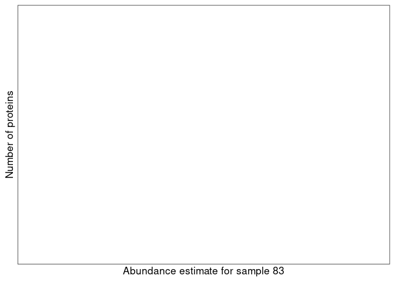

:speech\_balloon: *Is this what you would expect when looking at the
proteome of a sample?*

:pencil2: Select a protein and look at the distribution of abundance
estimates.

    selected_protein <- sample(protein_details$protein_id, 1)

    ggplot() +
      geom_histogram(
        data = protein_values,
        mapping = aes(
          x = !!sym(selected_protein)
        ),
        bins = 50,
        col = "darkgreen",
        fill = "darkgreen",
        alpha = 0.4
      ) +
      scale_x_continuous(
        name = glue("Abundance estimate of {selected_protein}")
      ) +
      scale_y_continuous(
        name = glue("Number of samples"),
        expand = expansion(
          mult = c(0, 0.05)
        )
      )

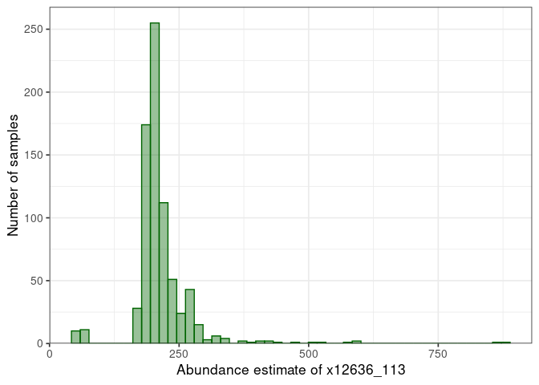

:speech\_balloon: *How does the distribution looks like? How will it
influence downstream analyses?*

:pencil2: Log, center, and scale the abundance of each protein.

    for (protein in protein_details$protein_id) {
      
      log_values <- log10(protein_values[[protein]][protein_values$sample_id %in% samples_details$id & !is.na(protein_values[[protein]]) & protein_values[[protein]] > 0])
      
      if (length(log_values) < 10) {
        stop(glue("Too few values for protein {protein}"))
      }
      
      mean_log <- mean(log_values, na.rm = T)
      sd_log <- sd(log_values, na.rm = T)
      
      new_column <- paste0(protein, "_log_std")
      
      protein_values[[new_column]] <- ifelse(protein_values$sample_id %in% samples_details$id & !is.na(protein_values[[protein]]) & protein_values[[protein]] > 0, (log10(protein_values[[protein]]) - mean_log) / sd_log, NA)
      
    }

:pencil2: Plot again the distribution for the selected protein.

    selected_protein_log_std <- paste0(selected_protein, "_log_std")

    ggplot() +
      geom_histogram(
        data = protein_values,
        mapping = aes(
          x = !!sym(selected_protein_log_std)
        ),
        bins = 50,
        col = "darkgreen",
        fill = "darkgreen",
        alpha = 0.4
      ) +
      scale_x_continuous(
        name = glue("Standardized abundance estimate of {selected_protein}")
      ) +
      scale_y_continuous(
        name = glue("Number of samples"),
        expand = expansion(
          mult = c(0, 0.05)
        )
      )

    ## Warning: Removed 657 rows containing non-finite values (stat_bin).

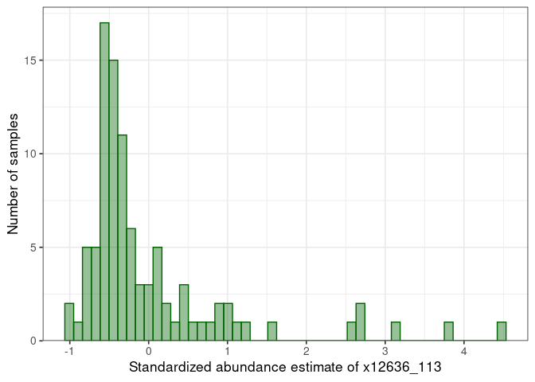

:pencil2: Plot the standardized vs non-standardized values.

    ggplot() +
      geom_point(
        data = protein_values,
        mapping = aes(
          x = !!sym(selected_protein),
          y = !!sym(selected_protein_log_std)
        ),
        col = "darkgreen",
        alpha = 0.1
      ) +
      scale_x_continuous(
        name = glue("Abundance estimate of {selected_protein}")
      ) +
      scale_y_continuous(
        name = glue("Standardized abundance estimate of {selected_protein}")
      )

    ## Warning: Removed 657 rows containing missing values (geom_point).

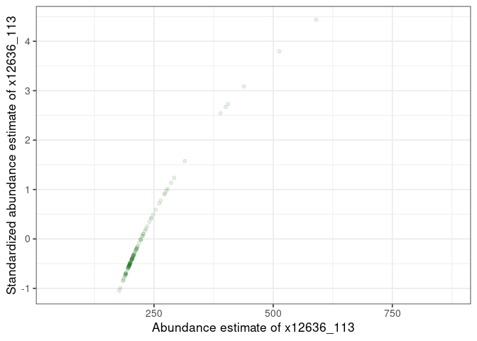

:pencil2: Plot again the distribution for the selected sample.

    selected_sample_std_values <- protein_values %>% 
      filter(
        sample_id == selected_sample
      ) %>% 
      select(
        ends_with("_log_std")
      ) %>% 
      pivot_longer(
        cols = ends_with("_log_std")
      )

    ggplot() +
      geom_histogram(
        data = selected_sample_std_values,
        mapping = aes(
          x = value
        ),
        bins = 50,
        col = "darkblue",
        fill = "darkblue",
        alpha = 0.4
      ) +
      scale_x_continuous(
        name = glue("Standardized abundance estimate for sample {selected_sample}")
      ) +
      scale_y_continuous(
        name = glue("Number of proteins"),
        expand = expansion(
          mult = c(0, 0.05)
        )
      )

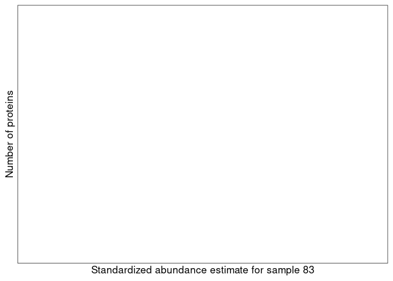

:pencil2: Plot the standardized vs non-standardized values.

    plot_values <- merge(selected_sample_values, selected_sample_std_values %>% rename(std_value = value) %>% mutate(name = str_remove(name, "_log_std")), by = "name")

    ggplot() +
      geom_point(
        data = plot_values,
        mapping = aes(
          x = value,
          y = std_value
        ),
        col = "darkblue",
        alpha = 0.1
      ) +
      scale_x_continuous(
        name = glue("Protein abundance estimate for {selected_sample}")
      ) +
      scale_y_continuous(
        name = glue("Standardized abundance estimate for {selected_sample}")
      )

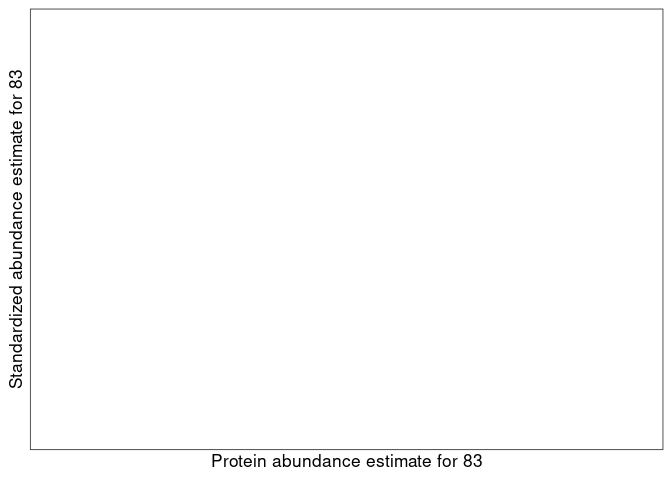

:speech\_balloon: *How do you interpret this plot?*

## Principal component analysis

:pencil2: Run a PCA on the standardized values.

    pca_input <- protein_values %>% 
      filter(
        sample_id %in% samples_details$id
      ) %>% 
      select(
        sample_id, ends_with("_log_std")
      )

    pca_samples <- pca_input$sample_id
    pca_input <- t(pca_input[, -1])
    colnames(pca_input) <- pca_samples

    pca <- prcomp(pca_input)

The quantitative information is now projected in a base of dimensions
ordered by decreasing amount of variance, the *principal components*. We
can plot the dimensions capturing most of the variance from the *sdev*
attribute of the pca result.

:pencil2: Plot the variance explained by the first ten components

    eigen_values <- pca$sdev ^ 2
    total_eigen_value <- sum(eigen_values)
    pc_contribution <- 100 * eigen_values / total_eigen_value

    ggplot() + 
      geom_col(
        mapping = aes(
          x = 1:10, 
          y = pc_contribution[1:10]
        )
      ) +
      scale_x_continuous(
        name = "PC"
      ) +
      scale_y_continuous(
        name = glue("Proportion of Variance [%]"),
        expand = expansion(
          mult = c(0, 0.05)
        )
      )

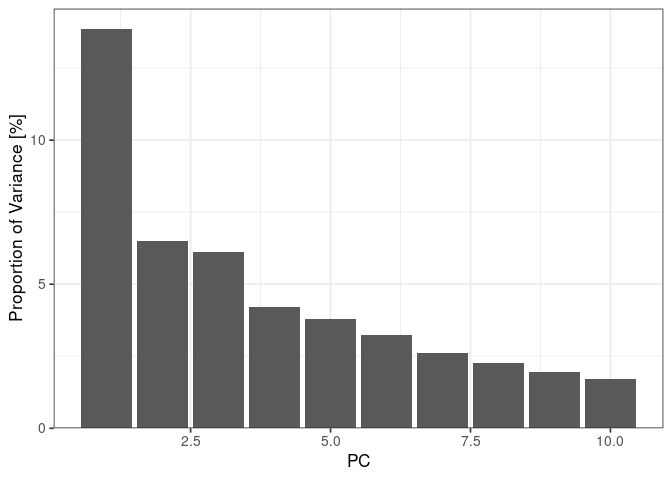

:speech\_balloon: *How do you interpret this plot?*

:pencil2: Plot the samples in the plane made by PC1 and PC2

    pc1 <- pca$rotation[,1]
    pc2 <- pca$rotation[,2]
    names <- dimnames(pca$rotation)[[1]]

    plot_data <- data.frame(
      pc1 = pc1,
      pc2 = pc2,
      id = names
    )

    contribution1 <- round(100 * eigen_values[1] / total_eigen_value)
    contribution2 <- round(100 * eigen_values[2] / total_eigen_value)

    ggplot() + 
      geom_point(
        data = plot_data,
        mapping = aes(
          x = pc1, 
          y = pc2
        ),
        alpha = 0.2
      ) + 
      xlab(glue("PC1 [{contribution1}%]")) + 
      ylab(glue("PC2 [{contribution2}%]"))

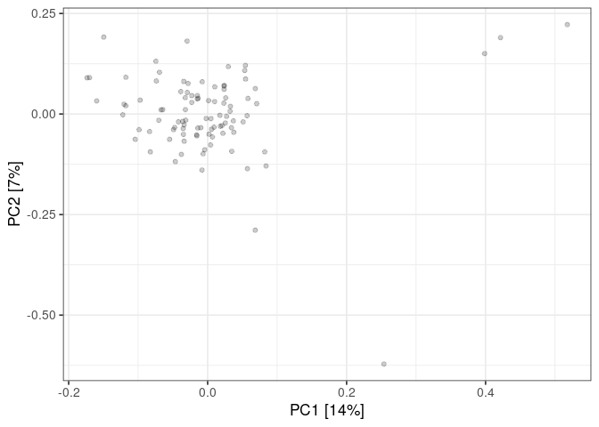

:pencil2: Color the points using the sample details.

    plot_data <- plot_data %>% 
      left_join(
        samples_details %>% 
          mutate(
            id = as.character(id)
          ),
        by = "id"
      )

    ggplot() + 
      geom_point(
        data = plot_data,
        mapping = aes(
          x = pc1, 
          y = pc2,
          col = age
        ),
        alpha = 0.2
      ) + 
      xlab(glue("PC1 [{contribution1}%]")) + 
      ylab(glue("PC2 [{contribution2}%]")) +
      scale_color_scico(
        name = "Age",
        palette = "berlin"
      )

    ggplot() + 
      geom_point(
        data = plot_data,
        mapping = aes(
          x = pc1, 
          y = pc2,
          col = bmi
        ),
        alpha = 0.2
      ) + 
      xlab(glue("PC1 [{contribution1}%]")) + 
      ylab(glue("PC2 [{contribution2}%]")) +
      scale_color_scico(
        name = "BMI",
        palette = "berlin"
      )

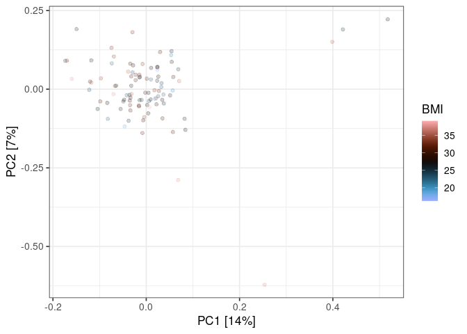

    ggplot() + 
      geom_point(
        data = plot_data,
        mapping = aes(
          x = pc1, 
          y = pc2,
          col = sex
        ),
        alpha = 0.2
      ) + 
      xlab(glue("PC1 [{contribution1}%]")) + 
      ylab(glue("PC2 [{contribution2}%]")) +
      scale_color_scico(
        name = "Sex",
        palette = "berlin"
      )

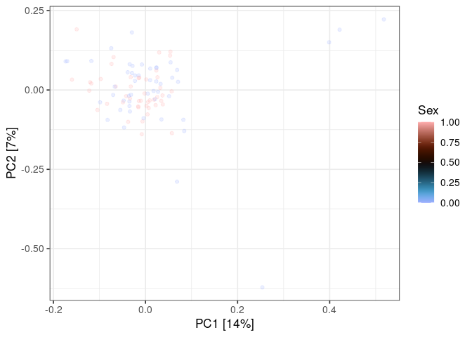

## Association analysis

:pencil2: Compute the association of the selected protein with one of
the disease classes

    class <- "Class_1"

    samples_tested <- samples_details %>% 
      filter(
        group == "Healthy" | group == class
      ) %>% 
      mutate(
        group_level = ifelse(group == "Healthy", 0, 1)
      )

    current_protein_values <- protein_values %>% 
      select(
        id = sample_id, 
        abundance = !!sym(selected_protein_log_std)
      )

    association_data <- samples_tested %>% 
      left_join(
        current_protein_values,
        by = "id"
      ) %>% 
      filter(
        !is.na(abundance)
      )

    lm_results <- lm(
      formula = "abundance ~ group_level + age + bmi + sex",
      data = association_data
    )

    summary(lm_results)

    ## 
    ## Call:
    ## lm(formula = "abundance ~ group_level + age + bmi + sex", data = association_data)
    ## 
    ## Residuals:
    ##     Min      1Q  Median      3Q     Max 
    ## -1.0805 -0.6187 -0.1706  0.4347  2.2845 
    ## 
    ## Coefficients:
    ##             Estimate Std. Error t value Pr(>|t|)  
    ## (Intercept) -2.78280    1.10235  -2.524   0.0163 *
    ## group_level -0.37788    0.32886  -1.149   0.2583  
    ## age          0.01107    0.01617   0.684   0.4983  
    ## bmi          0.07980    0.03533   2.259   0.0302 *
    ## sex          0.61198    0.31845   1.922   0.0628 .
    ## ---
    ## Signif. codes:  0 '***' 0.001 '**' 0.01 '*' 0.05 '.' 0.1 ' ' 1
    ## 
    ## Residual standard error: 0.8859 on 35 degrees of freedom
    ## Multiple R-squared:  0.2172, Adjusted R-squared:  0.1277 
    ## F-statistic: 2.428 on 4 and 35 DF,  p-value: 0.06612

:pencil2: Plot the association with all classes.

    classes <- c("Class_1", "Class_2a", "Class_2b", "Class_L")

    plot_data <- NULL

    for (class in classes) {
      
      samples_tested <- samples_details %>% 
        filter(
          group == "Healthy" | group == class
        ) %>% 
        mutate(
          group_level = ifelse(group == "Healthy", 0, 1)
        )
      
      current_protein_values <- protein_values %>% 
        select(
          id = sample_id, 
          abundance = !!sym(selected_protein_log_std)
        )
      
      association_data <- samples_tested %>% 
        left_join(
          current_protein_values,
          by = "id"
        ) %>% 
        filter(
          !is.na(abundance)
        )
      
      association_data$class <- class
      
      plot_data <- rbind(plot_data, association_data)
      
    }

    ggplot() + 
      geom_hline(
        yintercept = 0
      ) +
      geom_point(
        data = plot_data,
        mapping = aes(
          x = group_level, 
          y = abundance,
          col = class
        ),
        alpha = 0.2
      ) +
      geom_smooth(
        data = plot_data,
        mapping = aes(
          x = group_level, 
          y = abundance,
          col = class
        ),
        formula = "y ~ x",
        method = "lm"
      ) +
      scale_x_continuous(
        name = "Case or Control"
      ) + 
      scale_y_continuous(
        name = "Protein abundance"
      ) +
      facet_grid(
        . ~ class
      ) +
      theme(
        legend.position = "none"
      )

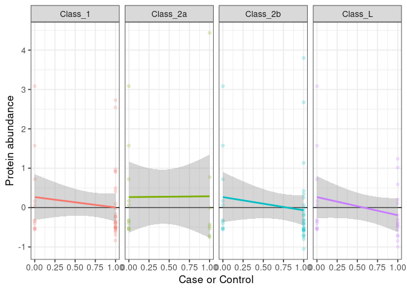

:pencil2: For every protein, run a linear model of every patient class
vs healthy taking age, BMI, and sex as covariate.

    classes <- c("Class_1", "Class_2a", "Class_2b", "Class_L")

    n <- length(classes) * nrow(protein_details)

    results <- data.frame(
      class = character(n),
      protein_id = character(n),
      uniprot_id = character(n),
      protein_name = character(n),
      beta = numeric(n),
      se = numeric(n),
      p = numeric(n),
      n = numeric(n),
      stringsAsFactors = F
    )

    i <- 1

    for (class in classes) {
      
      print(glue("{Sys.time()} - Processing {class}"))
      
      samples_tested <- samples_details %>% 
        filter(
          group == "Healthy" | group == class
        ) %>% 
        mutate(
          group_level = ifelse(group == "Healthy", 0, 1)
        )
      
      for (protein_index in 1:nrow(protein_details)) {
        
        protein_id <- protein_details$protein_id[protein_index]
        uniprot_id <- protein_details$uni_prot[protein_index]
        protein_name <- protein_details$target_full_name[protein_index]
        
        col_name <- paste0(protein_id, "_log_std")
        
        current_protein_values <- protein_values %>% 
          select(
            id = sample_id, 
            abundance = !!sym(col_name)
          )
        
        association_data <- samples_tested %>% 
          left_join(
            current_protein_values,
            by = "id"
          ) %>% 
          filter(
            !is.na(abundance)
          )
        
        lm_results <- lm(
          formula = "abundance ~ group_level + age + bmi + sex",
          data = association_data
        )
        
        lm_summary <- summary(lm_results)
        
        results$class[i] <- class
        results$protein_id[i] <- protein_id
        results$uniprot_id[i] <- uniprot_id
        results$protein_name[i] <- protein_name
        results$beta[i] <- lm_summary$coefficients["group_level", 1]
        results$se[i] <- lm_summary$coefficients["group_level", 2]
        results$p[i] <- lm_summary$coefficients["group_level", 4]
        results$n[i] <- nrow(association_data)
        
        i <- i + 1
        
      }
      
    }

    ## 2022-06-20 08:57:06 - Processing Class_1
    ## 2022-06-20 08:59:55 - Processing Class_2a
    ## 2022-06-20 09:02:42 - Processing Class_2b
    ## 2022-06-20 09:05:29 - Processing Class_L

:pencil2: Plot the significance against the effect size for each
comparison.

    ggplot() + 
      geom_point(
        data = results,
        mapping = aes(
          x = beta, 
          y = -log10(p),
          col = class
        ),
        alpha = 0.2
      ) + 
      geom_hline(
        yintercept = 2,
        col = "darkgreen",
        linetype = "dashed"
      ) +
      scale_x_continuous(
        name = "Effect size"
      ) + 
      scale_y_continuous(
        name = "p-value [-log10]"
      ) +
      facet_grid(
        . ~ class
      ) +
      theme(
        legend.position = "none"
      )

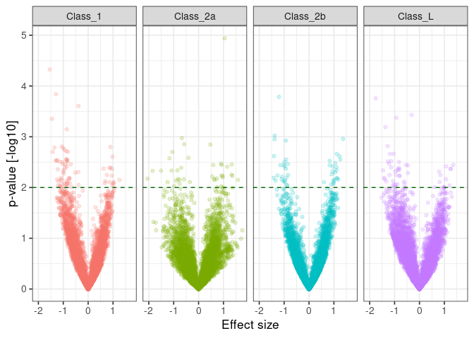

:pencil2: Plot the observed against expected p-value for each class.

    qq_data <- results %>% 
      group_by(
        class
      ) %>% 
      mutate(
        logP = -log10(p)
      ) %>% 
      arrange(
        logP
      ) %>% 
      mutate(
        expectedLogP = sort(-log10(ppoints(n = n())))
      ) %>% 
      ungroup()

    ggplot() + 
      geom_abline(
        slope = 1,
        intercept = 0,
        color = "black",
        linetype = "dashed"
      ) +
      geom_point(
        data = qq_data,
        mapping = aes(
          x = expectedLogP, 
          y = logP,
          col = class
        ),
        alpha = 0.2
      ) + 
      geom_hline(
        yintercept = 2,
        col = "darkgreen",
        linetype = "dashed"
      ) +
      scale_x_continuous(
        name = "Effect size"
      ) + 
      scale_y_continuous(
        name = "p-value [-log10]"
      ) +
      facet_grid(
        . ~ class
      ) +
      theme(
        legend.position = "none"
      )

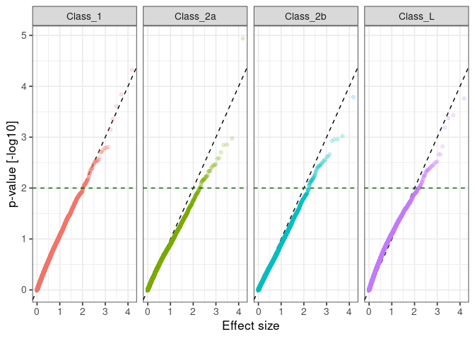
